> **Nota sobre el entorno**
>
> La práctica se ha realizado en local sobre **Arch Linux / CachyOS** con
> **Docker 29.5** y **Docker Compose v2**. Los datos elegidos (y anotados) para
> MySQL son: contraseña de root `rootpass`, base de datos `stepan_db`
> (formato `[nombre]_db`), usuario `stepan` con contraseña `stepanpass`.
> Se usan los puertos `8080` (web) y `8081` (phpMyAdmin).

---

# Parte 1: Docker (Dockerfile)

## 1-2. `index.php` de prueba y `Dockerfile`

Se crea `src/index.php` con `<?php phpinfo(); ?>` y un `Dockerfile` basado en la
imagen oficial **php:8.2-apache**, que copia `index.php` a `/var/www/html`, expone
el puerto 80 y arranca Apache:

```dockerfile
FROM php:8.2-apache
COPY index.php /var/www/html/
EXPOSE 80
CMD ["apache2-foreground"]
```

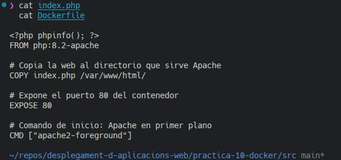

## 3. Construcción de la imagen

```bash
docker build -t miweb .
```

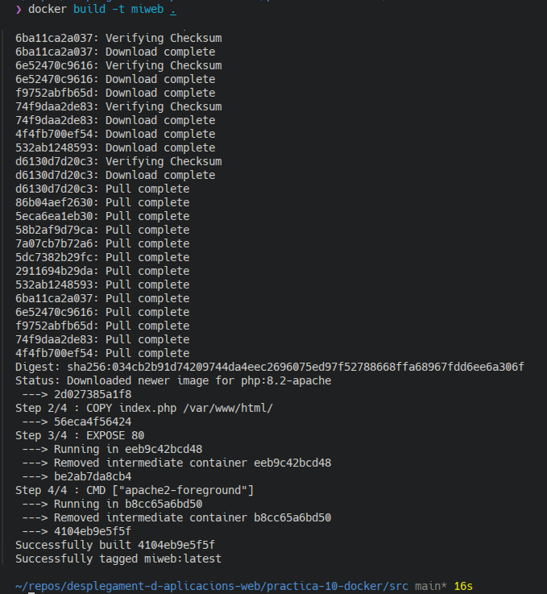

## 4. Ejecución del contenedor

Se ejecuta enlazando el puerto 8080 del host al 80 del contenedor, con nombre
`miweb`:

```bash
docker run -d -p 8080:80 --name miweb miweb
```

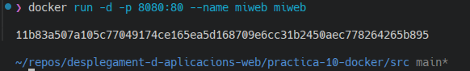

En `http://localhost:8080` se muestra la información de PHP (`phpinfo`):

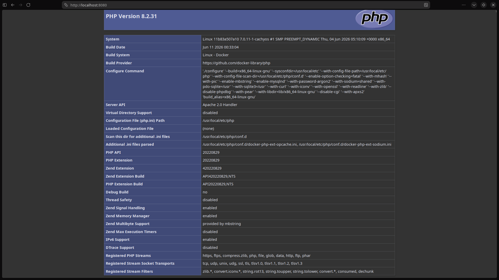

## 5. Listado y parada del contenedor

```bash
docker ps
docker stop miweb
```

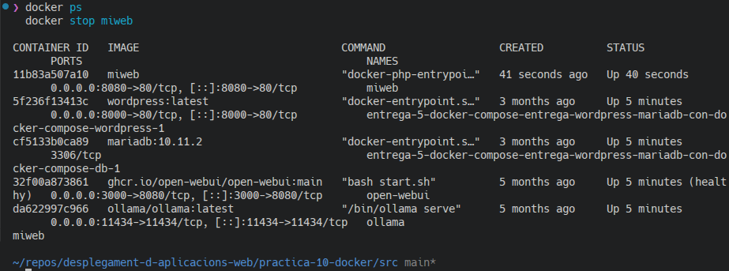

---

# Parte 2: Docker-compose (MySQL)

## 6. `docker-compose.yml` con MySQL

Se define un `docker-compose.yml` con dos servicios: **web** (construido desde
nuestro `Dockerfile`, puerto 8080:80) y **db** (imagen `mysql:8.0`).

**Información añadida (variables de entorno de MySQL):**

- `MYSQL_ROOT_PASSWORD: rootpass` — contraseña del usuario root de MySQL.
- `MYSQL_DATABASE: stepan_db` — base de datos creada automáticamente
  (formato `[nombre]_db`).
- `MYSQL_USER: stepan` y `MYSQL_PASSWORD: stepanpass` — usuario propio con su
  contraseña, con privilegios sobre `stepan_db`.

Además, `command: --general-log=1 --general-log-file=...` activa el registro
general para poder ver las conexiones.

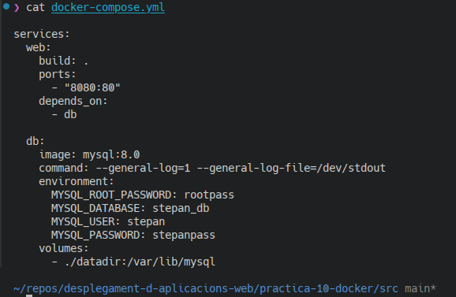

## 7. Volumen para persistencia (`datadir`)

Para mantener los datos de MySQL aunque se eliminen los contenedores, se define un
**volumen de tipo bind** que enlaza la carpeta local `src/datadir` con
`/var/lib/mysql` del contenedor:

```yaml
volumes:
  - ./datadir:/var/lib/mysql
```

Tras el primer arranque, MySQL inicializa sus datos en `datadir` (se observa la
carpeta de la base `stepan_db`):

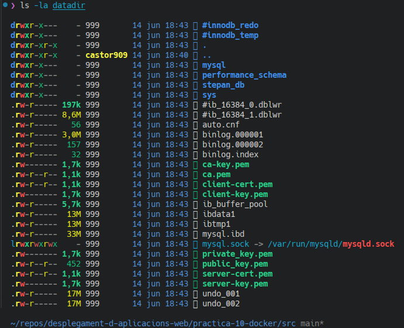

## 8. `db_test.php`, reconstrucción y verificación

Se crea `db_test.php`, que conecta con el servicio `db` usando los datos
definidos. Se edita el `Dockerfile` para instalar la extensión **mysqli**
(necesaria para conectar PHP con MySQL) y copiar `db_test.php`:

```dockerfile
FROM php:8.2-apache
RUN docker-php-ext-install mysqli
COPY index.php /var/www/html/
COPY db_test.php /var/www/html/
EXPOSE 80
CMD ["apache2-foreground"]
```

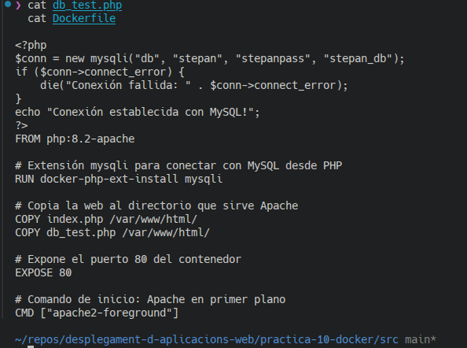

Se arranca toda la pila reconstruyendo la imagen:

```bash
docker compose up -d --build
```

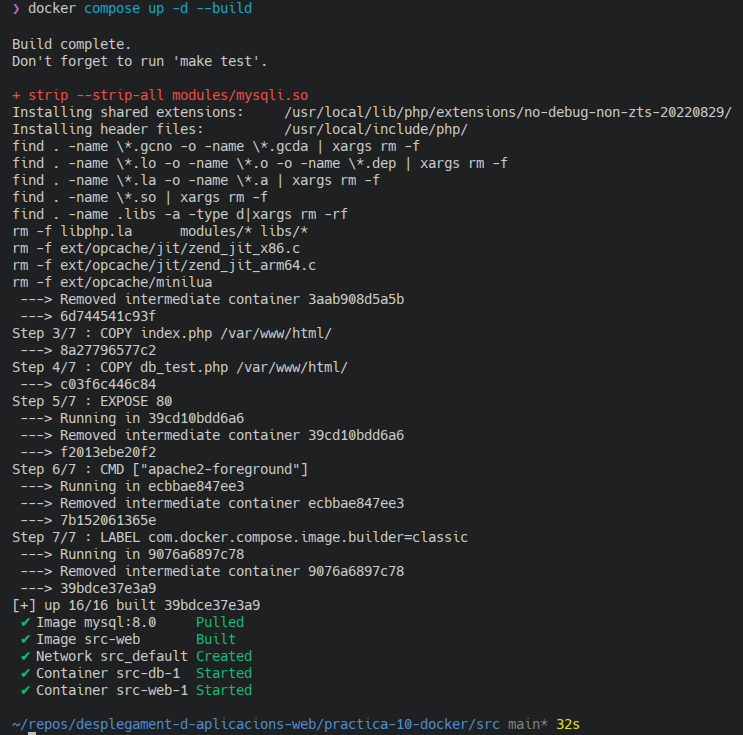

En `http://localhost:8080/db_test.php` se confirma la conexión:

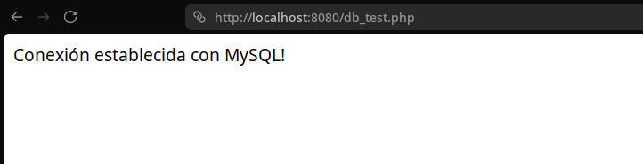

Y en los logs de MySQL se ve la conexión realizada desde el navegador
(`Connect stepan@... on stepan_db`):

```bash
docker exec src-db-1 tail -n 25 /var/lib/mysql/general.log
```

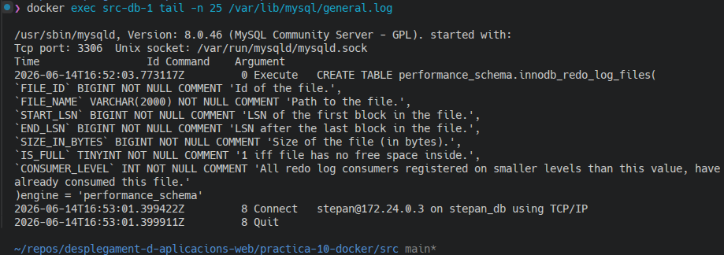

---

# Parte 3: phpMyAdmin y despliegue de la app

## 9. Añadir phpMyAdmin

Se detienen los contenedores:

```bash
docker compose down
```

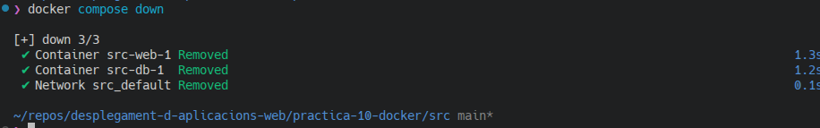

Se añade el servicio **phpmyadmin** al `docker-compose.yml`: imagen
`phpmyadmin:latest`, puertos **8081:80**, y variables `PMA_HOST: db` (apunta al
servicio MySQL) y `MYSQL_ROOT_PASSWORD: rootpass`.

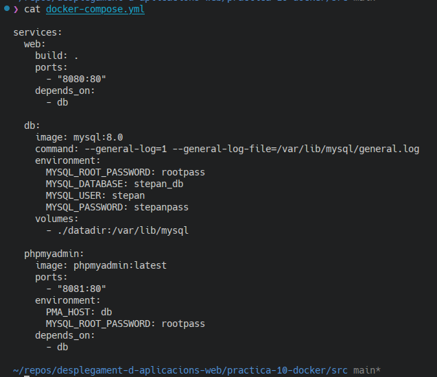

```bash
docker compose up -d
```

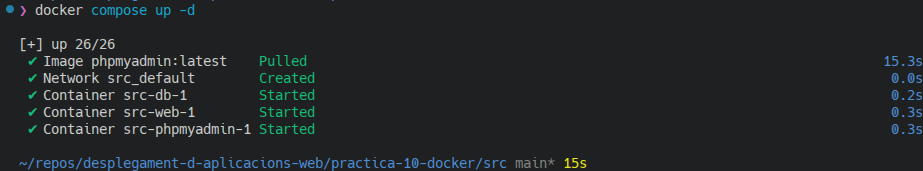

En `http://localhost:8081` se accede como **root** y se comprueba que aparece la
base de datos `stepan_db`:

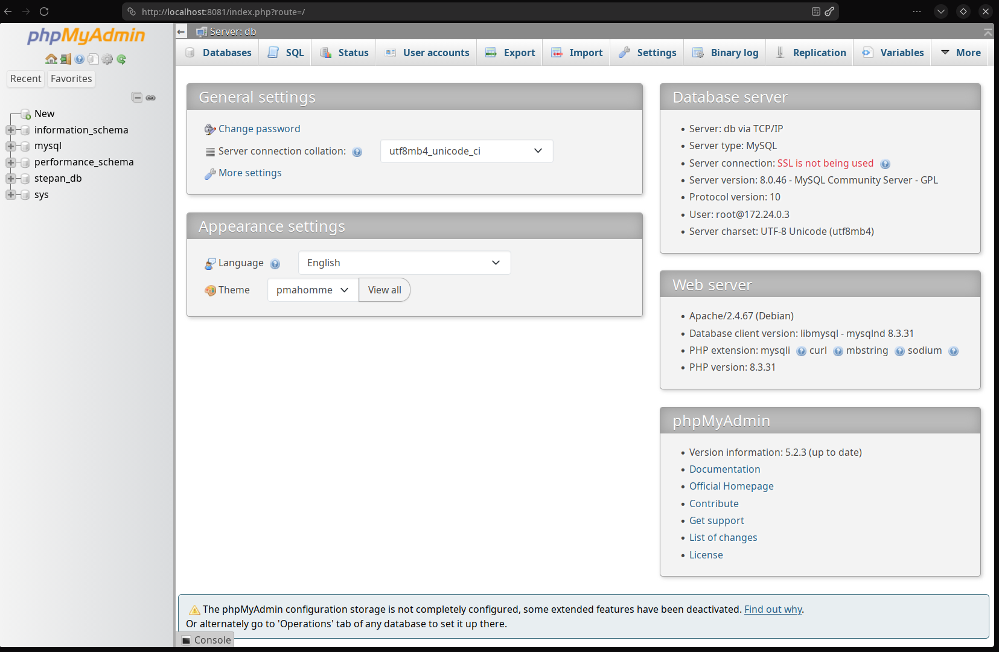

## 10. Despliegue de la aplicación web (chat) y persistencia

Se detienen los contenedores (`docker compose down`):

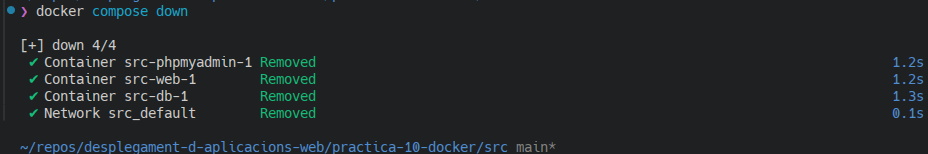

**a)** Se edita el `index.php` adjunto (chat) con los datos de conexión: servicio
`db`, usuario `stepan`, contraseña `stepanpass`, base `stepan_db`:

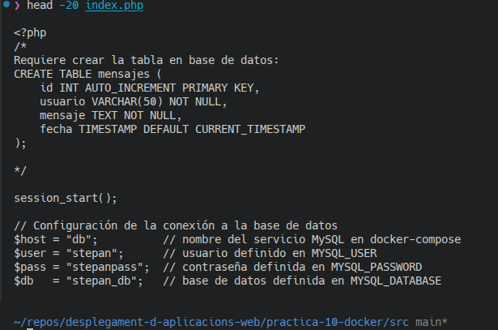

**b)** No es necesario modificar el `Dockerfile`: ya contiene
`COPY index.php /var/www/html/`, por lo que al reconstruir toma el nuevo
`index.php`. **c)** Tampoco hubo que cambiar `docker-compose.yml`.

**d)** Se reconstruye y arranca:

```bash
docker compose up -d --build
```

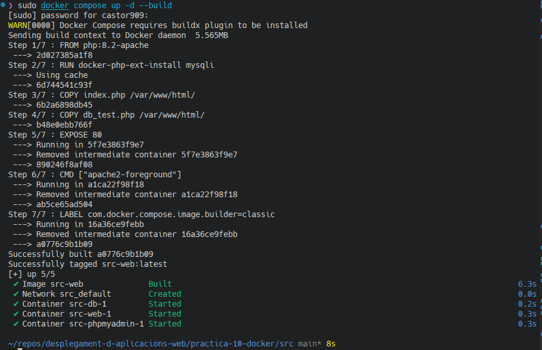

**e)** En `http://localhost:8080` funciona la aplicación de chat; se introducen
varios mensajes:

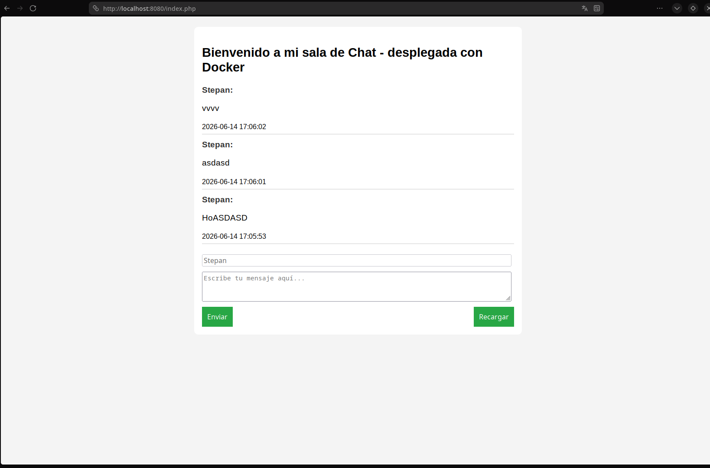

**f)** Tras `docker compose down` y `docker compose up`, los mensajes **siguen
existiendo** gracias al volumen `datadir`:

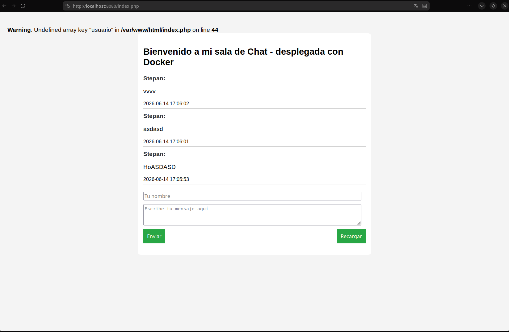

> El aviso de PHP (`Undefined array key "usuario"`) proviene del código original
> adjunto y es inofensivo; no afecta a la persistencia.

Contenido de `src/datadir` (datos de MySQL persistidos):

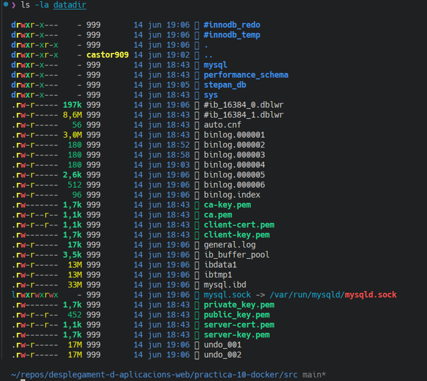

La tabla `mensajes` de `stepan_db` en phpMyAdmin conserva los registros:

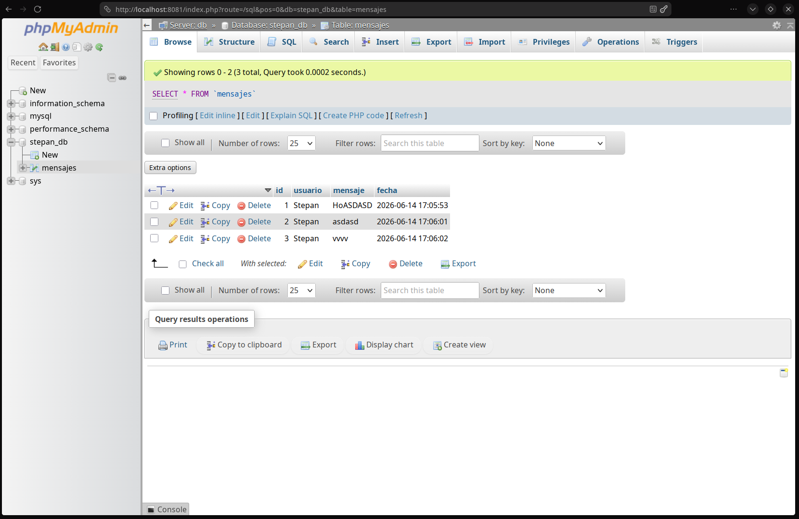

---

## Conclusión

El resultado es una **pila LAMP desplegada con Docker**: Apache+PHP (servicio
`web`), MySQL (servicio `db`) y phpMyAdmin (servicio `phpmyadmin`), orquestados
con `docker-compose.yml` en una misma red. El volumen `datadir` garantiza la
**persistencia** de los datos: los mensajes creados sobreviven al borrado y
recreación de los contenedores.
