> **Nota sobre el entorno**
>
> El servidor DNS (BIND9) se instala sobre la VM **Ubuntu Server 24.04**
> (`192.168.1.178`, red `192.168.1.0/24`). El cliente es la máquina **host con
> Arch/CachyOS** (no Windows), por lo que los comandos de Windows del enunciado
> se sustituyen por sus equivalentes de **systemd-resolved**:
>
> | Windows | Linux (host, systemd-resolved) |
> |---|---|
> | `ipconfig /displaydns` | `resolvectl statistics` |
> | `ipconfig /flushdns` | `sudo resolvectl flush-caches` |
> | Cambiar DNS del adaptador | `sudo resolvectl dns wlan0 <ip>` |
>
> Como la IP no es la del ejemplo (192.168.5.x) sino `192.168.1.178`, la zona
> inversa es `1.168.192.in-addr.arpa` y el PTR es el octeto `178`. En la VM, la
> resolución vía BIND se fija con `resolvectl dns enp0s3 127.0.0.1`. Para
> comprobar Internet en la VM se usa `ping -4` (la VM no tiene ruta IPv6).

---

## 1. Instalación de BIND9 y firewall

Se actualiza el sistema y se instala **bind9** (en Ubuntu 24.04 el servicio es
`named`):

```bash
sudo apt update && sudo apt upgrade -y
sudo apt install -y bind9
```

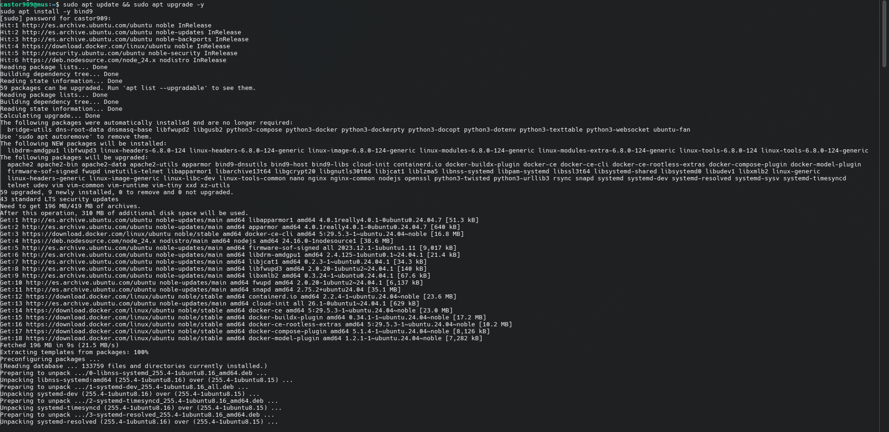

Se verifica que el servicio queda habilitado en el arranque y activo:

```bash
sudo systemctl is-enabled named
sudo systemctl status named
```

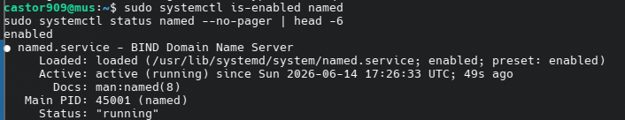

Se abren SSH y BIND9 (puerto 53) en el firewall y se activa:

```bash
sudo ufw allow ssh
sudo ufw allow bind9
sudo ufw enable
sudo ufw status verbose
```

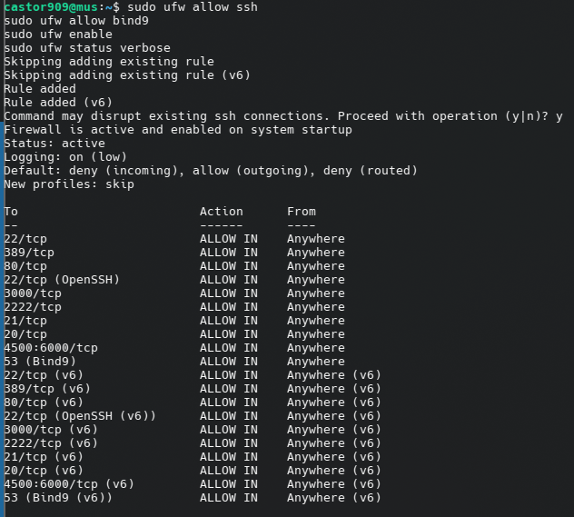

---

## 2. Configuración de `named.conf.options`

Se editan `/etc/bind/named.conf.options` (forwarders, `allow-query` con la
red/máscara del servidor, `listen-on` IPv4 y `dnssec-validation no`) y
`/etc/default/named` (`OPTIONS="-u bind -4"` para que BIND resuelva solo IPv4):

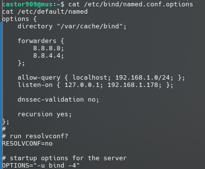

Se verifica la sintaxis, se reinicia y se comprueba el estado:

```bash
sudo named-checkconf
sudo systemctl restart named
sudo systemctl status named
```

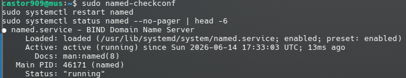

---

## 3. Zonas directa e inversa

En `/etc/bind/named.conf.local` se declaran la zona `dawserver.com` y la inversa
`1.168.192.in-addr.arpa`, y en `/etc/bind/zonas/` se crean los ficheros
`db.dawserver.com` (hostname `dawser`, `www` y `@` → 192.168.1.178) y
`db.192.168.1` (PTR `178` → `dawser.dawserver.com`):

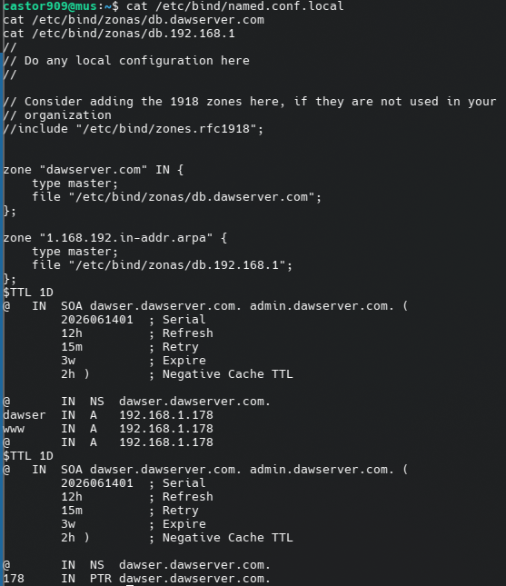

Se validan ambas zonas:

```bash
sudo named-checkzone dawserver.com /etc/bind/zonas/db.dawserver.com
sudo named-checkzone 1.168.192.in-addr.arpa /etc/bind/zonas/db.192.168.1
```

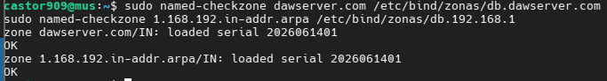

Tras reiniciar, el log muestra ambas zonas cargadas (`loaded serial`):

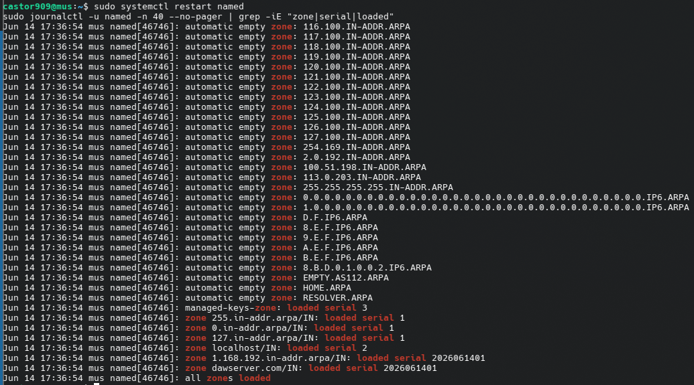

---

## 4. Resolución mediante el DNS propio y sitio web

Se comprueba que la VM tiene Internet (`ping -4 google.com`):

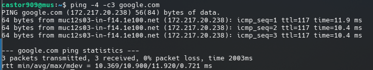

Desde el host, `www.dawserver.com` **no** resuelve todavía (el host aún no usa el
DNS creado):

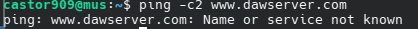

En la VM se deja `/etc/hosts` con solo la línea de loopback (copia de seguridad en
`hosts.bak`) y se apunta el resolver de la VM a su propio BIND
(`resolvectl dns enp0s3 127.0.0.1`). Ahora la VM resuelve `www.dawserver.com` →
`192.168.1.178` mediante su DNS:

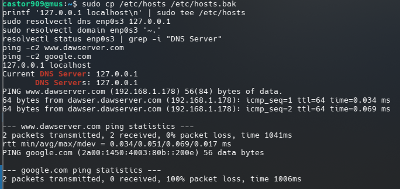

Se deshabilita el firewall de la VM (paso requerido):

```bash
sudo ufw disable
```

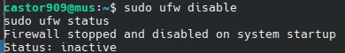

Se configura el sitio Apache con `ServerName www.dawserver.com`. En esta VM el
puerto 80 lo servía nginx y no existía `sitio1.conf`, por lo que se crea
`/etc/apache2/sites-available/sitio1.conf`, se habilita y se conmuta el puerto 80
a Apache:

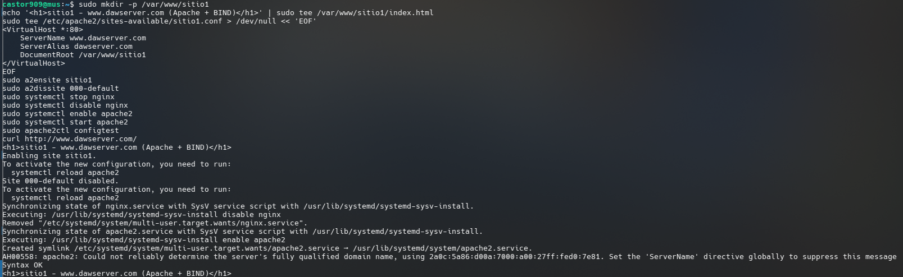

---

## 5. El host usa el DNS creado (captura DNS)

En el host se apunta el DNS al servidor de la VM y se vacía la caché
(equivalentes de `ipconfig /displaydns` y `/flushdns`):

```bash
resolvectl statistics
sudo resolvectl flush-caches
sudo resolvectl dns wlan0 192.168.1.178
resolvectl query www.dawserver.com
```

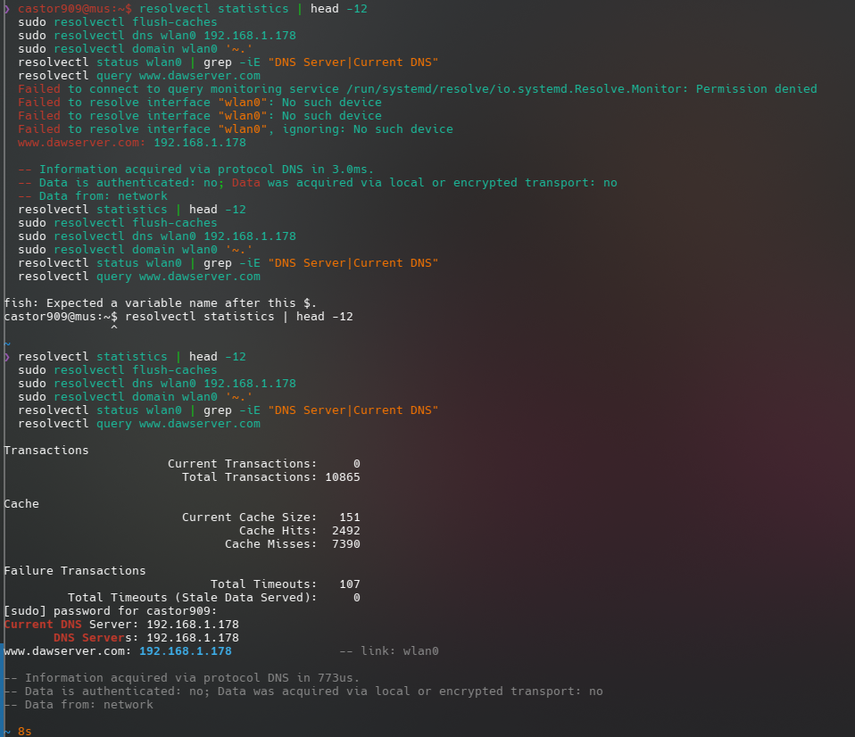

Con Wireshark capturando, se accede a `http://www.dawserver.com` desde el
navegador, mostrando el sitio `sitio1`:

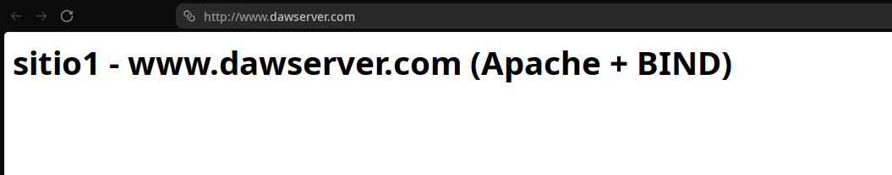

La captura (filtro `dns && ip.addr == 192.168.1.178`) confirma que la consulta DNS
de `www.dawserver.com` se realiza al servidor de la VM:

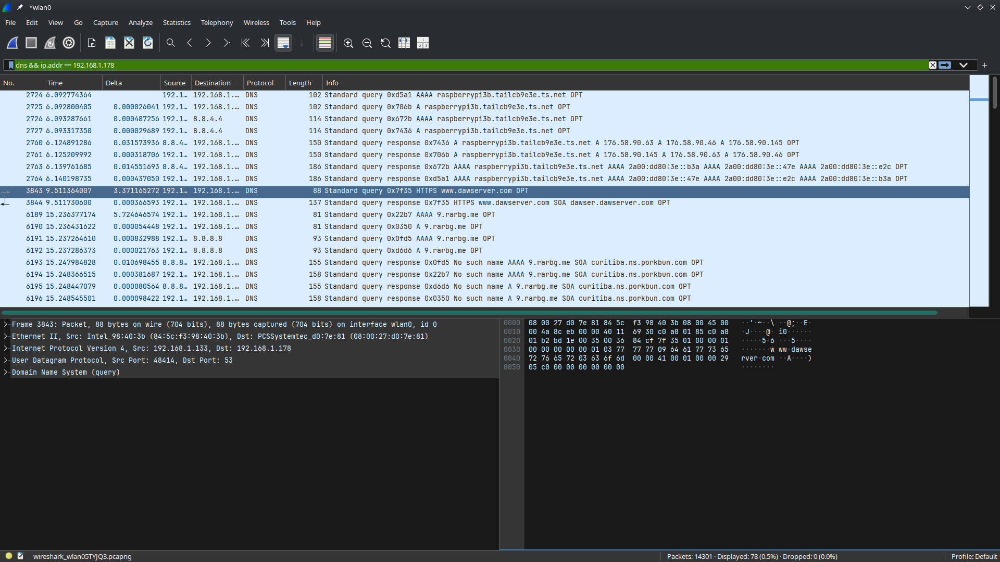

---

## BONUS — DNS primario = VM, secundario = 8.8.8.8

Se configura el host con el DNS de la VM como primario y `8.8.8.8` como
secundario:

```bash
sudo resolvectl dns wlan0 192.168.1.178 8.8.8.8
sudo resolvectl flush-caches
resolvectl status wlan0
```

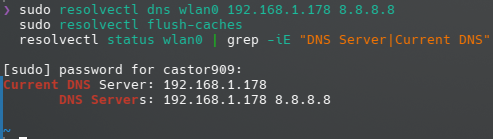

Se navega a un sitio **distinto** de dawserver.com (`example.com`):

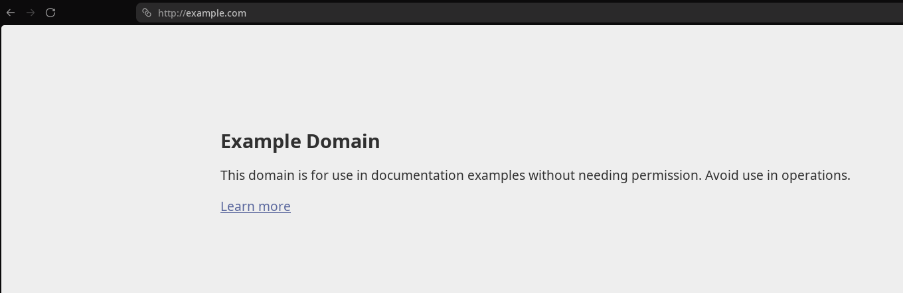

La captura muestra que incluso para un dominio externo, la consulta DNS se envía
**al servidor de la VM** (`192.168.1.178`), que la reenvía a sus forwarders:

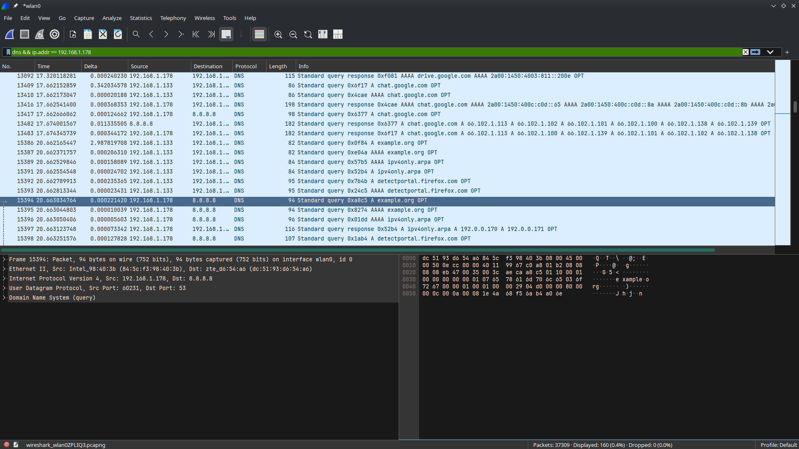

---

## Conclusión

Se ha montado un servidor **DNS autoritativo con BIND9** para el dominio
`dawserver.com`, con zona directa e inversa, forwarders y resolución IPv4. Se ha
comprobado que tanto la VM como el host resuelven `www.dawserver.com` a través de
este servidor, accediendo al sitio Apache asociado, y que el host puede usar la VM
como servidor DNS primario para toda su navegación.
