# DAW_P12_Andreev

**Student:** Stepan Andreev
**Course:** DAW  
**Practice:** 12. LDAP  
**Environment:** Arch Linux host in VS Code + Ubuntu Server VM

## Introduction

This report documents the deployment of an LDAP directory service on Ubuntu Server and its integration with Apache for centralized authentication.

## 1. LDAP installation, service enablement, and firewall

### 1.0 Environment notes

**VM IP:** 192.168.1.140

**Hostname:** mtu

**SSH access from Arch Linux:** ssh user@192.168.1.140 (or replace `user` with actual Ubuntu username)

**Notes:** Ubuntu 24.04.3 LTS on VirtualBox. SSH service enabled and running. Bonus: will implement StartTLS or LDAPS for secure LDAP connections.

### 1.1 System update

**What I did:** Updated package lists and checked system upgrades on Ubuntu Server.

**Commands used:**
sudo apt update && sudo apt upgrade -y

**Result:** The system repositories were reached successfully, package lists were updated, and there were no pending upgrades (`0 upgraded, 0 newly installed, 0 to remove, and 0 not upgraded`).

**Evidence:**
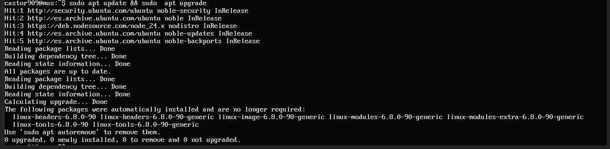

### 1.2 LDAP packages installation

**What I did:** Installed OpenLDAP server and LDAP client utilities, then verified both packages are present in the system.

**Commands used:**
sudo apt install -y slapd ldap-utils
sudo dpkg -l | grep -E "slapd|ldap-utils"

**Result:** Both required packages are installed (`ldap-utils` and `slapd`, version `2.6.10+dfsg-0ubuntu0.24.04.1`, amd64).

**Evidence:**
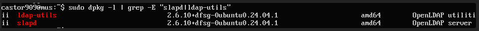

### 1.3 Service activation and verification

**What I did:** Enabled `slapd` for automatic startup and verified runtime status with systemd.

**Commands used:**
sudo systemctl enable slapd
sudo systemctl status slapd --no-pager
sudo systemctl is-enabled slapd

**Result:** `slapd.service` is active and running. Ubuntu reports a SysV compatibility redirection for enablement (`systemd-sysv-install`) because `slapd` is managed through generated service wrappers; this behavior is expected.

**Evidence:**
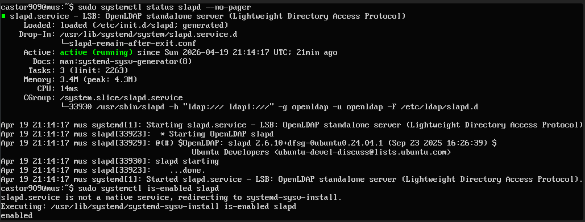

### 1.4 Firewall rules

**What I did:** Verified UFW status and confirmed inbound rules for SSH and LDAP.

**Commands used:**
sudo ufw status verbose

**Result:** UFW is active with default deny for incoming traffic, and explicit allow rules are present for `22/tcp` (SSH) and `389/tcp` (LDAP), including IPv6 entries.

**Evidence:**
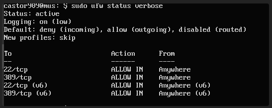

## 2. LDAP base configuration and initial directory tree

### 2.0 Base DN plan

**Chosen domain:** dawserver.com

**Base DN:** dc=dawserver,dc=com

**Organization name:** dawserver

### 2.1 slapd reconfiguration

**What I did:** Reconfigured `slapd` with `dpkg-reconfigure slapd` and defined the LDAP naming context for the practice.

**Base DN:** dc=dawserver,dc=com

**Result:** Reconfiguration completed successfully using MDB backend and a new admin password; LDAP service remained available after configuration.

**Evidence:**
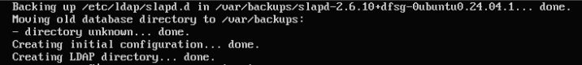

### 2.2 Base LDIF

**LDIF content:**

```ldif
dn: dc=dawserver,dc=com
objectClass: top
objectClass: dcObject
objectClass: organization
o: dawserver
dc: dawserver

dn: ou=usuarios,dc=dawserver,dc=com
objectClass: organizationalUnit
ou: usuarios

dn: ou=grupos,dc=dawserver,dc=com
objectClass: organizationalUnit
ou: grupos
```

**Import command:**
ldapadd -x -D "cn=admin,dc=dawserver,dc=com" -W -f base.ldif

After the first attempt returned `Already exists (68)` for the base DN, the OU entries were imported separately:

ldapadd -x -D "cn=admin,dc=dawserver,dc=com" -W -f ous.ldif

**Result:** The base domain entry already existed after reconfiguration, and both organizational units were created successfully (`ou=usuarios` and `ou=grupos`).

**Evidence:**
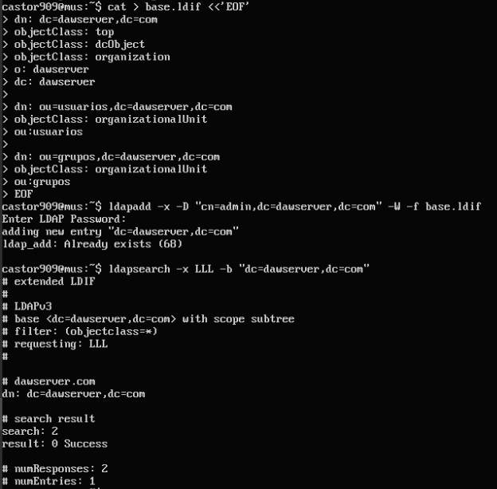

### 2.3 Directory verification

**Search command:**
ldapsearch -x -LLL -b "dc=dawserver,dc=com"
ldapsearch -x -LLL -b "dc=dawserver,dc=com" "(ou=usuarios)"
ldapsearch -x -LLL -b "dc=dawserver,dc=com" "(ou=grupos)"

**Result:** LDAP search confirms the directory tree contains the base DN plus both OUs. Filtered searches by `ou` also return the expected entries.

**Evidence:**
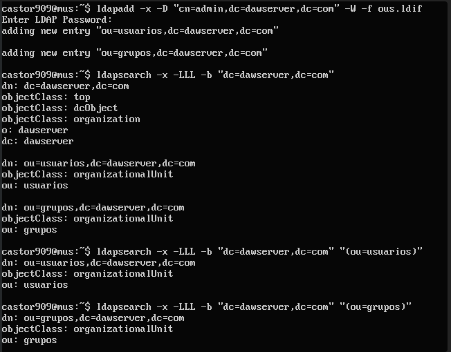

## 3. Users and groups

### 3.0 User and group plan

**User 1:** usuario1

**User 2:** usuario2

**User 3:** usuario3

**Group:** webusers

### 3.1 User entries

**What I did:** Imported LDAP user entries for three practice accounts and verified that the entries exist in the directory.

**LDIF content:**

```ldif
dn: uid=usuario1,ou=usuarios,dc=dawserver,dc=com
objectClass: inetOrgPerson
objectClass: posixAccount
objectClass: shadowAccount
cn: Usuario Uno
sn: Uno
uid: usuario1
uidNumber: 10001
gidNumber: 10000
homeDirectory: /home/usuario1
loginShell: /bin/bash
mail: usuario1@dawserver.com
userPassword: usuario1pass

dn: uid=usuario2,ou=usuarios,dc=dawserver,dc=com
objectClass: inetOrgPerson
objectClass: posixAccount
objectClass: shadowAccount
cn: Usuario Dos
sn: Dos
uid: usuario2
uidNumber: 10002
gidNumber: 10000
homeDirectory: /home/usuario2
loginShell: /bin/bash
mail: usuario2@dawserver.com
userPassword: usuario2pass

dn: uid=usuario3,ou=usuarios,dc=dawserver,dc=com
objectClass: inetOrgPerson
objectClass: posixAccount
objectClass: shadowAccount
cn: Usuario Tres
sn: Tres
uid: usuario3
uidNumber: 10003
gidNumber: 10000
homeDirectory: /home/usuario3
loginShell: /bin/bash
mail: usuario3@dawserver.com
userPassword: usuario3pass
```

**Result:** `ldapadd` reported `Already exists (68)` on re-import, which confirms the user entries had already been created. The directory searches show `usuario1` and `usuario2` correctly stored with all required attributes.

**Evidence:**
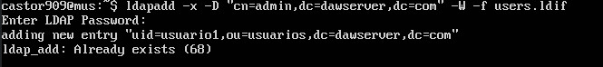

### 3.2 Group entry

**What I did:** Imported the practice group and verified that it contains the expected user memberships.

**LDIF content:**

```ldif
dn: cn=webusers,ou=grupos,dc=dawserver,dc=com
objectClass: posixGroup
cn: webusers
gidNumber: 10000
memberUid: usuario1
memberUid: usuario2
memberUid: usuario3
```

**Result:** `ldapadd` reported `Already exists (68)` on re-import, which confirms the group already exists. The search output shows the `webusers` group with `gidNumber` and all three `memberUid` values.

**Evidence:**
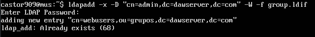

### 3.3 LDAP verification queries

**Search command:**
ldapsearch -x -LLL -b "ou=usuarios,dc=dawserver,dc=com" "(uid=usuario1)"
ldapsearch -x -LLL -b "ou=usuarios,dc=dawserver,dc=com" "(cn=Usuario Dos)"
ldapsearch -x -LLL -b "ou=grupos,dc=dawserver,dc=com" "(cn=webusers)"

**Result:** The directory returns the expected user and group entries. `usuario1` and `usuario2` are visible with their attributes, and `webusers` contains `usuario1`, `usuario2`, and `usuario3` as members.

**Evidence:**
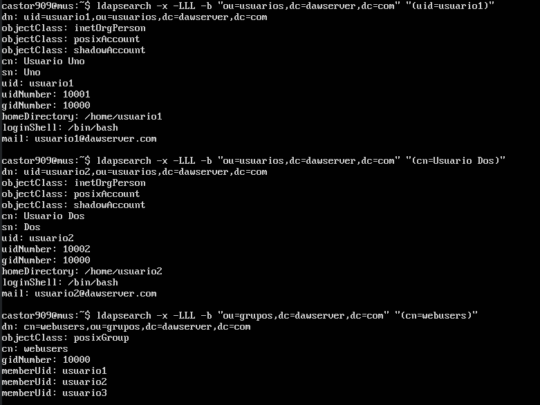

## 4. Apache integration with LDAP authentication

### 4.0 Apache plan

**Protected path:** /var/www/html/privado

**LDAP URL:** ldap://127.0.0.1:389/ou=usuarios,dc=dawserver,dc=com?uid?sub?(objectClass=inetOrgPerson)

**Apache modules enabled:** ldap, authnz_ldap

### 4.1 Protected directory

**What I did:** Created and protected the `/var/www/html/privado` directory to require LDAP authentication.

**Result:** Apache accepted the LDAP auth configuration. `apache2ctl configtest` returns only an FQDN warning (non-blocking).

**Evidence:**
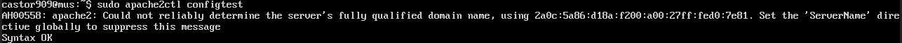

### 4.2 Apache LDAP configuration

**Config snippet:**

```apache
<Directory /var/www/html/privado>
	AuthType Basic
	AuthName "Acceso privado LDAP"
	AuthBasicProvider ldap
	AuthLDAPURL "ldap://127.0.0.1:389/ou=usuarios,dc=dawserver,dc=com?uid?sub?(objectClass=inetOrgPerson)"
	AuthLDAPBindDN "cn=admin,dc=dawserver,dc=com"
	AuthLDAPBindPassword "[REDACTED]"
	Require valid-user
</Directory>

```

**Result:** Apache LDAP directives were applied correctly for the protected directory.

**Evidence:**
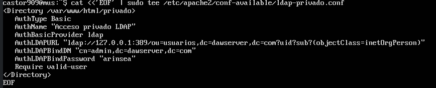
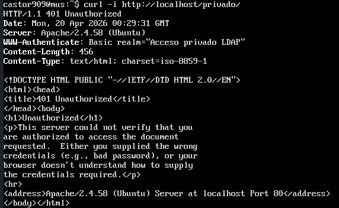

### 4.3 Access tests

**Denied without credentials:** `curl -i http://localhost/privado/` returns `HTTP/1.1 401 Unauthorized`.

**Allowed with LDAP user:** `curl -i -u usuario1:usuario1pass http://localhost/privado/` returns `HTTP/1.1 200 OK` and serves the private page content.

**Evidence:**
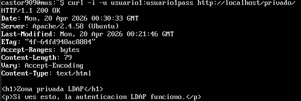

## 5. Client-side verification and traffic capture

### 5.0 Client verification plan

**LDAP client command:** ldapwhoami -x -D "uid=usuario1,ou=usuarios,dc=dawserver,dc=com" -W

**Browser test location:** Arch Linux host (outside the VM) using curl against http://192.168.1.140/privado/

**Capture tool:** tcpdump or Wireshark on the Ubuntu Server VM (interface connected to 192.168.1.140)

### 5.1 LDAP authentication test

**Command:** ldapwhoami -x -D "uid=usuario1,ou=usuarios,dc=dawserver,dc=com" -W

**Result:** Successful LDAP bind. The server returned the authenticated identity:

dn:uid=usuario1,ou=usuarios,dc=dawserver,dc=com

**Evidence:**
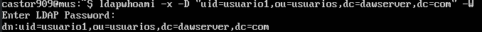

### 5.2 Browser access from client

**Result:** From the Arch Linux host, client-to-server access behaves as expected.

- Without credentials: `HTTP/1.1 401 Unauthorized` for `GET /privado/`.
- With LDAP credentials (`usuario1:usuario1pass`): `HTTP/1.1 200 OK` and private page content returned.

This confirms remote Apache LDAP authentication works from another machine, not only locally on the VM.

**Evidence:**
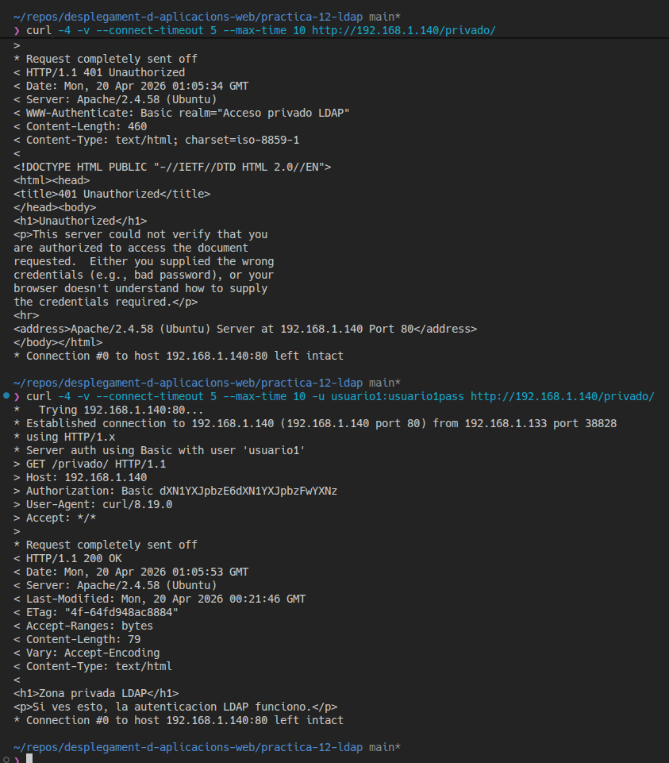

### 5.3 Traffic capture

**Tool used:** `tcpdump` on the Ubuntu Server VM (`sudo tcpdump -i any -n -vv "tcp port 80 or tcp port 389"`).

**What the capture proves:** The capture shows real client-to-server HTTP traffic from `192.168.1.133` to `192.168.1.140:80`, including `GET /privado/` and `HTTP/1.1 200 OK`. This confirms the authenticated request path from external client to Apache. In this test run, the screenshot clearly documents web authentication flow over HTTP; LDAP bind verification is already proven in section 5.1 (`ldapwhoami`).

**Evidence:**
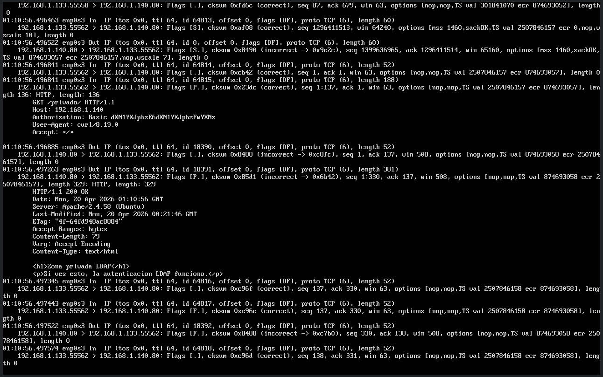

## Bonus (optional)

### Secure LDAP or phpLDAPadmin

**What I did:** No bonus feature was added in this submission.

**Result:** The mandatory tasks were prioritized and completed in a stable state (LDAP directory, Apache integration, client verification, and traffic capture).

**Evidence:** Not applicable.

## Conclusion

This practice deployed a complete LDAP-based authentication environment on Ubuntu Server and validated it end-to-end from an external client machine.

The OpenLDAP service was installed and configured with base DN `dc=dawserver,dc=com`, organizational units (`ou=usuarios`, `ou=grupos`), three users, and one group (`webusers`). Directory consistency was verified with multiple ldapsearch queries.

Apache was integrated with LDAP authentication for a protected directory (`/var/www/html/privado`) using `mod_ldap` and `mod_authnz_ldap`. Access behavior was validated both locally and remotely: unauthenticated requests returned `401 Unauthorized`, while valid LDAP credentials returned `200 OK`.

Final client-side validation included `ldapwhoami` successful bind and packet capture evidence with tcpdump, confirming the HTTP authentication flow between host and VM. The resulting setup demonstrates centralized credential management with LDAP and practical web access control through Apache.

## Appendix

### Useful commands

- `apt update && apt upgrade`
- `apt install slapd ldap-utils`
- `ldapsearch`
- `ldapadd`
- `ldapwhoami`
- Apache restart and status commands

### Notes

- Report title and student full name are already filled for this submission.
- Keep the report in the same order as the assignment.
- Add concise explanations below each screenshot.

### Screenshot inventory

Save the screenshots inside the `captures` folder using these filenames so they can be embedded into the markdown report later.

- `1.1-update-upgrade.png` - apt update and apt upgrade output.
- `1.2-install-packages.png` - slapd and ldap-utils installation plus package verification.
- `1.3-slapd-status.png` - systemctl enable/status/is-enabled output for slapd.
- `1.4-ufw-status.png` - UFW verbose status showing SSH and LDAP rules.
- `2.1-slapd-reconfigure.png` - slapd reconfiguration wizard completed.
- `2.2-base-ldif-import.png` - base LDIF and OU import output.
- `2.3-base-search.png` - ldapsearch showing the base tree and OU filters.
- `3.1-users-import.png` - user LDIF import output.
- `3.2-group-import.png` - group LDIF import output.
- `3.3-ldapsearch-users-group.png` - filtered ldapsearch results for users and group.
- `4.1-apache-config.png` - Apache configtest output.
- `4.2-apache-ldap-config.png` - Apache LDAP auth configuration file content.
- `4.2-apache-denied.png` - browser access denied without credentials.
- `4.3-apache-allowed.png` - browser access allowed with LDAP credentials.
- `5.1-ldapwhoami.png` - client authentication test.
- `5.2-browser-client.png` - browser access from client machine.
- `5.3-capture.png` - Wireshark or tcpdump capture.

