# Informe Practica 2 - Apache Web Server

Alumno: castor909  
Asignatura: Desplegament d'aplicacions web  
Practica: Practica2_25_26.pdf

## Punto 1. Instalacion de Apache y verificacion de estado
Se instala Apache y se verifica el estado del servicio. En la captura se observa el servicio activo en ejecucion.

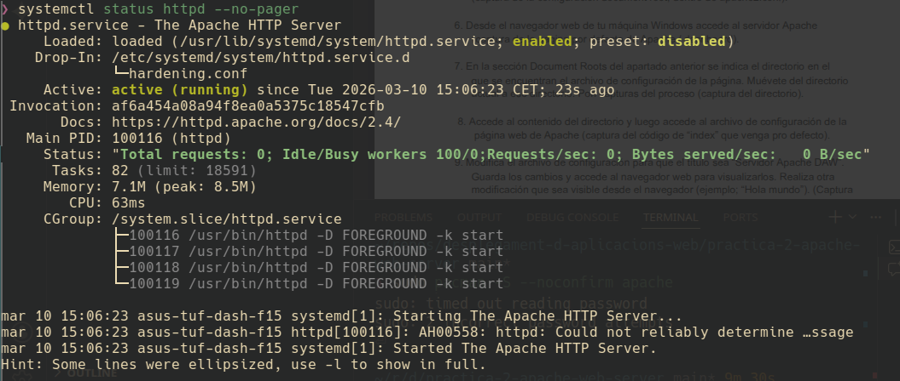

## Punto 2. Contenido del directorio de configuracion
Se muestra la estructura del directorio de configuracion de Apache.

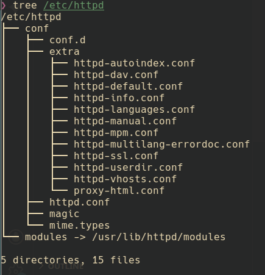

## Punto 3. Copia de seguridad del archivo de configuracion
Se crea una copia de seguridad del archivo principal de configuracion y se verifica su existencia en el directorio.

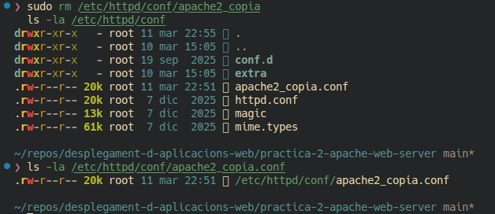

## Punto 4. Edicion del archivo de configuracion
Se accede al archivo de configuracion principal para su edicion desde terminal.

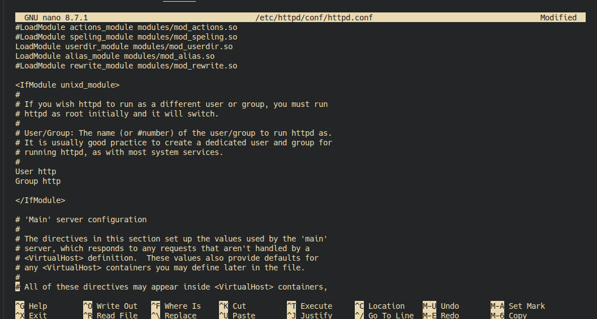

## Punto 5. Jerarquia de configuracion y DocumentRoot
Se muestra la configuracion del DocumentRoot y la jerarquia de inclusion de configuraciones.

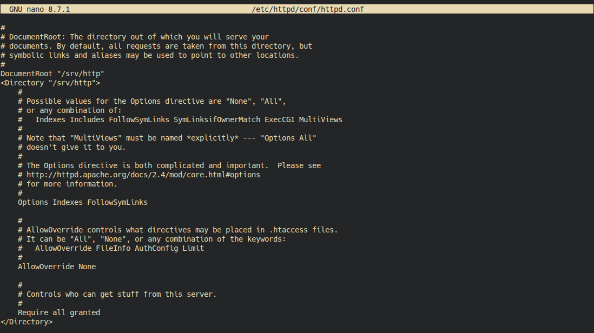

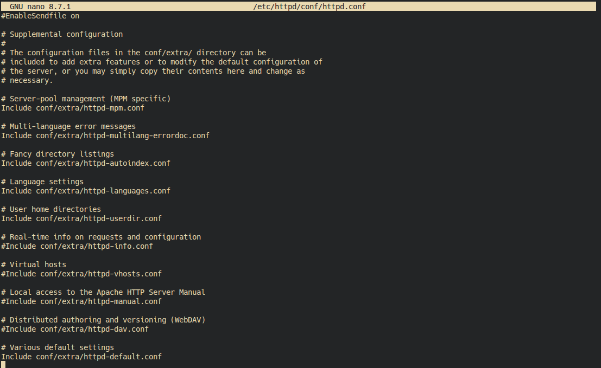

## Punto 6. Acceso al servidor Apache desde navegador
Se accede al servidor web desde navegador y se verifica la pagina servida por Apache.

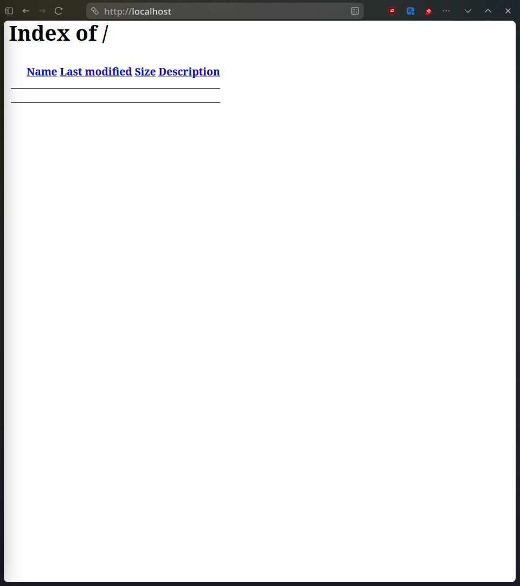

## Punto 7. Acceso al DocumentRoot
Se navega al directorio DocumentRoot indicado en la configuracion del servidor.

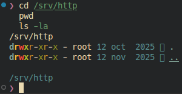

## Punto 8. Acceso al archivo index por defecto
Se lista el contenido del directorio web y se muestra el codigo del archivo index.

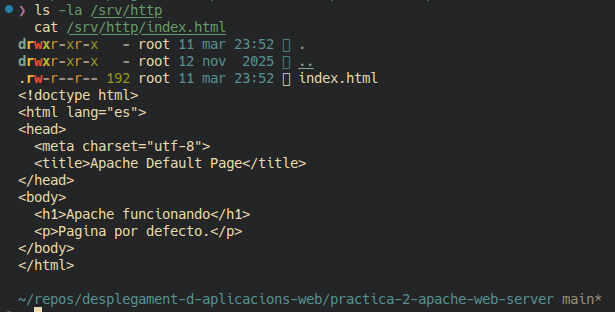

## Punto 9. Modificacion de la pagina web
Se modifica el titulo a "Servidor Apache DAW" y se agrega contenido visible en pagina ("Hola mundo").

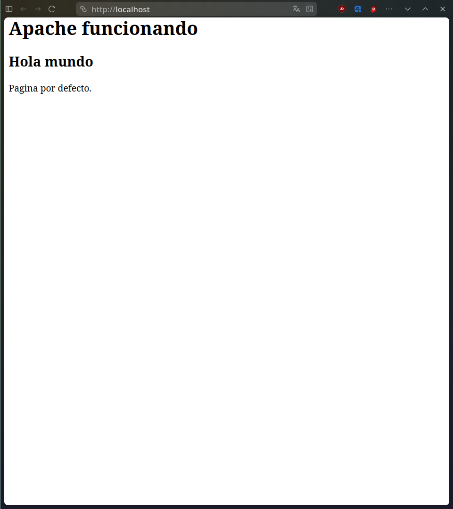

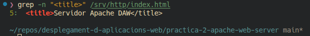

## Punto 10. Captura de trafico con Wireshark
Se captura trafico HTTP entre cliente y servidor. En la captura se observan paquetes HTTP GET y HTTP 200 OK, junto con IP de origen/destino y cabeceras HTTP.

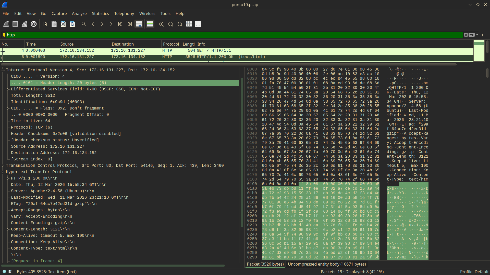

## Observaciones tecnicas
- En entorno Arch/CachyOS el servicio se gestiona como `httpd` y la configuracion principal se encuentra en `/etc/httpd/conf/httpd.conf`.
- Para la parte de red de la practica se utilizo una VM Ubuntu Server con Apache activo para validar el trafico HTTP en Wireshark.
- Se verifico la conectividad y el funcionamiento del servidor antes de realizar la captura final de paquetes.
