# Práctica 3. Servidores Virtuales

**Nombre del alumno:** 

## 1. Modificación del archivo hosts y comprobación de ping

Se ha editado el archivo `/etc/hosts` para añadir las direcciones de los dos servidores virtuales, `www.sitio1.com` y `www.sitio2.com`, para que se resuelvan en la dirección de loopback (127.0.0.1).

**Captura 1.1:** Archivo hosts modificado

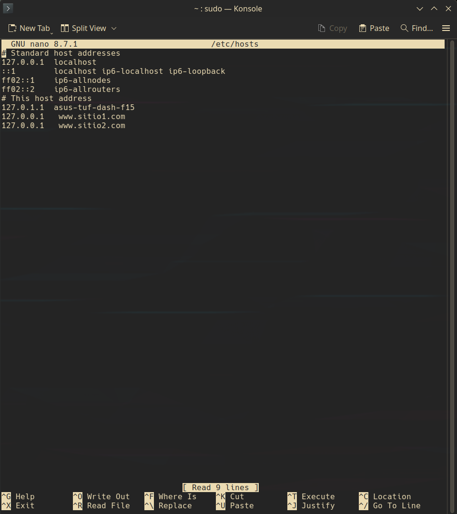

A continuación, se realizó un ping exitoso a ambas direcciones:

**Captura 1.2:** Ping a sitio1 y sitio2

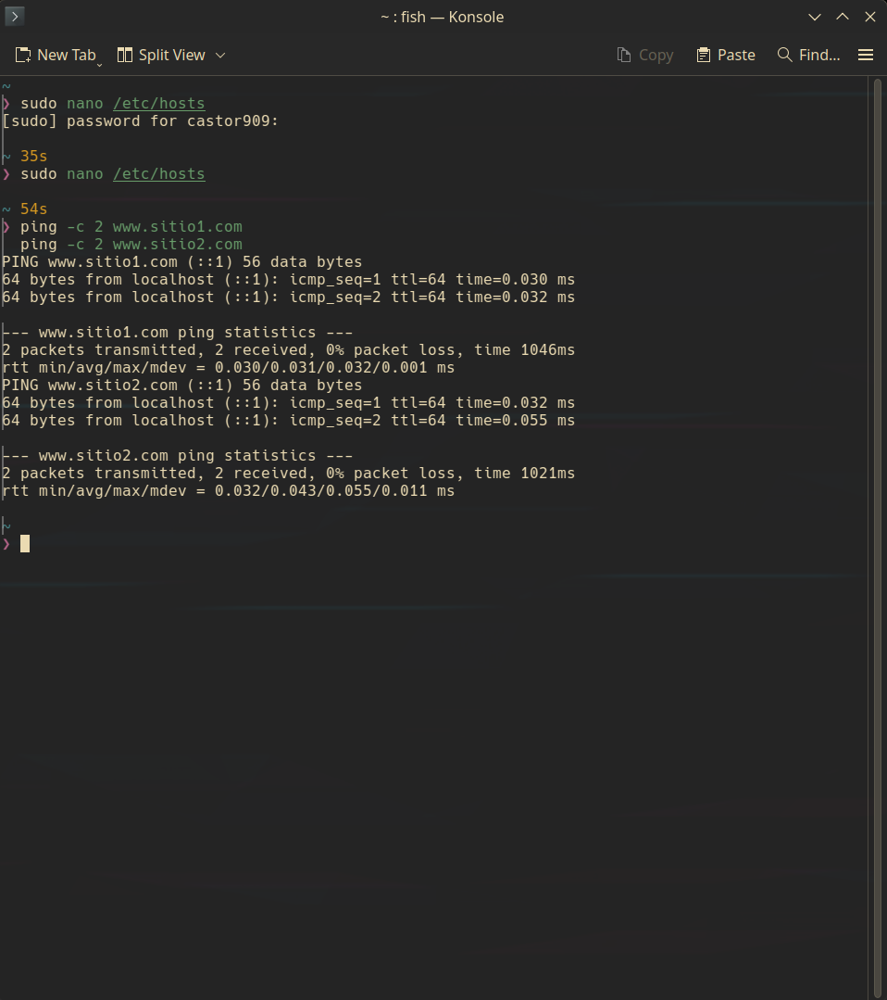

## 2. Creación de carpetas y archivos index.html

Se crearon las carpetas `/srv/http/sitio1` y `/srv/http/sitio2`, así como los archivos `index.html` correspondientes con el texto "Bienvenido a Sitio1" y "Bienvenido a Sitio2" para identificar cada página.

**Captura 2.1:** Creación de directorios y archivos index.html

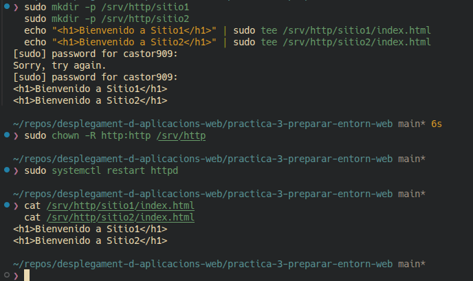

**Captura 2.2:** Contenido de index.html de sitio1 en el navegador

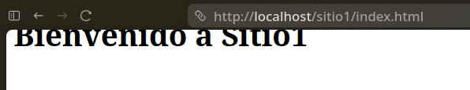

**Captura 2.3:** Contenido de index.html de sitio2 en el navegador

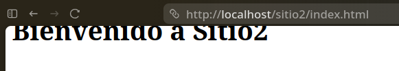

## 3. Copia y renombrado de archivo de configuración para sitio1

Se copió y editó el archivo de configuración para sitio1: `sitio1.conf` en `/etc/httpd/conf/extra`.

**Captura 3:** Listado de archivos en `/etc/httpd/conf/extra` con el nuevo sitio1.conf

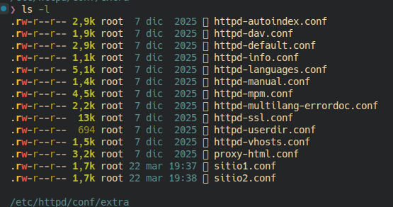

## 4. Modificación de sitio1.conf

Se modificó el archivo sitio1.conf, estableciendo `ServerName www.sitio1.com` y `DocumentRoot /srv/http/sitio1`.

**Captura 4:** sitio1.conf modificado

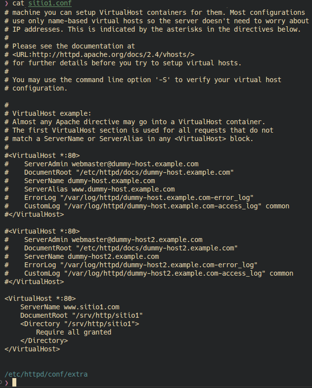

## 5. Proceso repetido para sitio2

De forma análoga, se creó y editó el archivo de configuración sitio2.conf para www.sitio2.com y /srv/http/sitio2.

**Captura 5:** sitio2.conf modificado

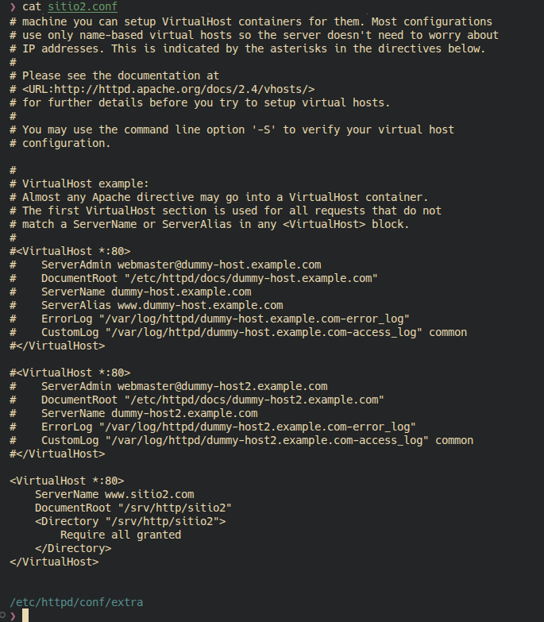

## 6. Activación de los sitios virtuales

Los hosts virtuales fueron activados mediante la directiva `Include` en el archivo principal de configuración de Apache (`/etc/httpd/conf/httpd.conf`):

```
Include conf/extra/sitio1.conf
Include conf/extra/sitio2.conf
```

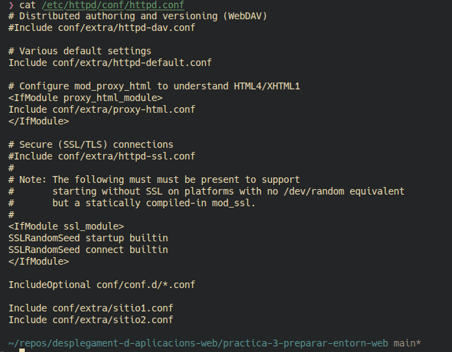

## 7. Verificación de enlaces simbólicos en sites-enabled

Se comprobó la existencia de los archivos sitio1.conf y sitio2.conf en `/etc/httpd/conf/extra` y su contenido.

**Captura 7.1:** Listado de archivos en `/etc/httpd/conf/extra`

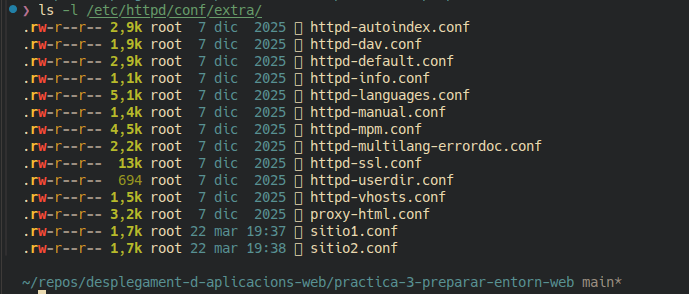

**Captura 7.2:** Contenido de sitio1.conf

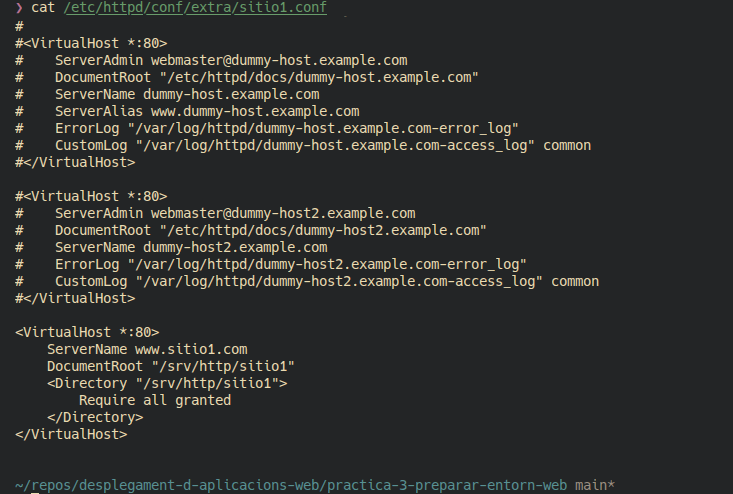

**Captura 7.3:** Contenido de sitio2.conf

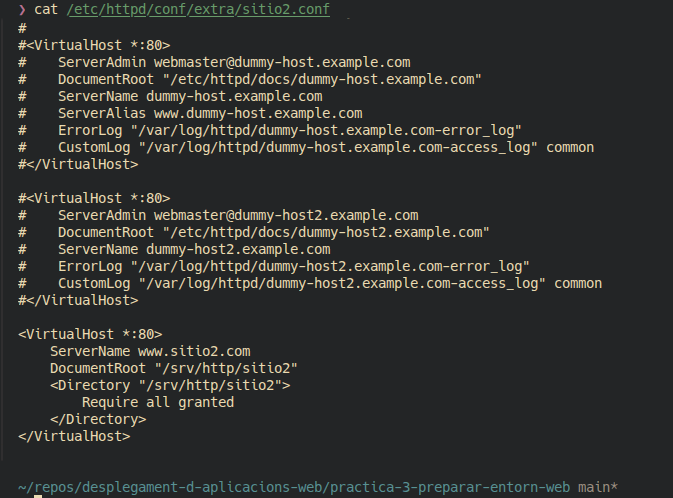

## 8. Recarga de Apache

El servicio Apache fue reiniciado con el siguiente comando:

```
sudo systemctl restart httpd
```

**Captura 8:** Reinicio de httpd

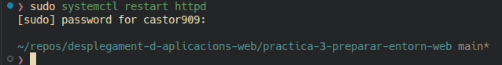

## 9. Acceso desde navegador

En el navegador se abrieron:
- http://localhost/sitio1/index.html
- http://localhost/sitio2/index.html
- http://www.sitio1.com
- http://www.sitio2.com

**Captura 9.1:** www.sitio1.com


**Captura 9.2:** www.sitio2.com


**Fecha de entrega:** 22 de marzo de 2026

**Nota:** Todas las capturas están numeradas según el punto correspondiente del informe.