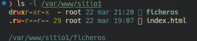
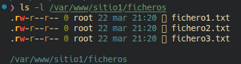
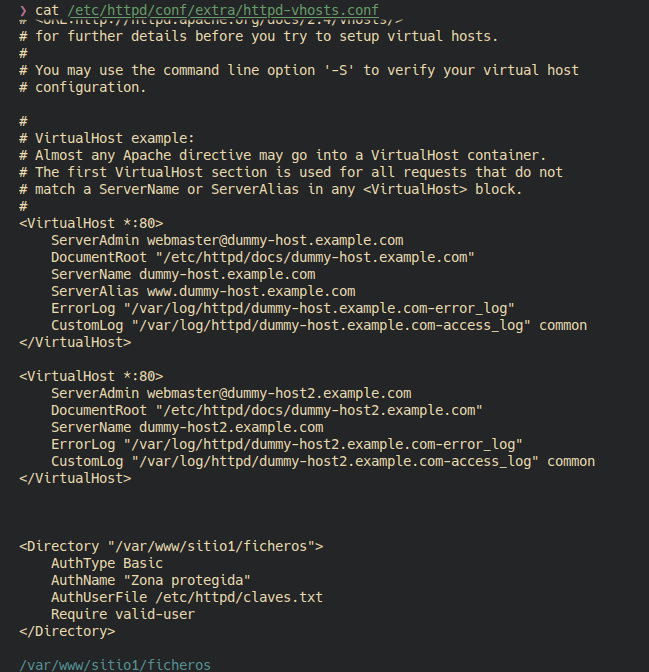
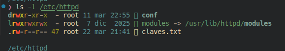
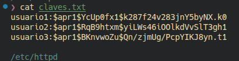
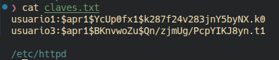
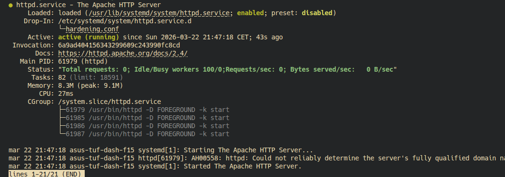
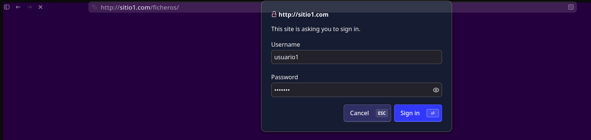
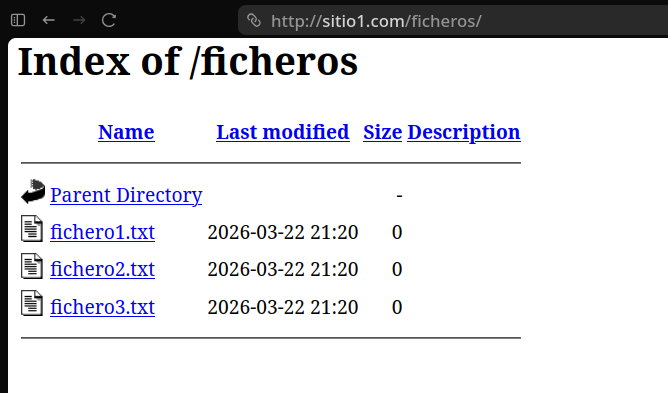

# Parte Primera

## 1. Creación de la carpeta y archivos

Se creó la carpeta `ficheros` dentro de `/var/www/sitio1` y se añadieron los archivos requeridos.

**Directorio `/var/www/sitio1` mostrando la carpeta `ficheros`:**  

**Contenido de la carpeta `/var/www/sitio1/ficheros` con los archivos de texto creados:**  

---

## 2. Configuración del VirtualHost para autenticación

Se configuró el VirtualHost para proteger la carpeta `ficheros` mediante autenticación básica.

**Fragmento del archivo de configuración con la directiva `<Directory>` para la autenticación:**  

---

## 3. Creación del archivo de claves

Se generó el archivo `claves.txt` en `/etc/httpd` para almacenar las credenciales de los usuarios.

**Archivo `claves.txt` presente en `/etc/httpd`:**  

**Contenido de `claves.txt` con tres usuarios añadidos:**  

---

## 4. Gestión de usuarios en el archivo de claves

Se eliminó un usuario del archivo de claves y se comprobó el resultado.

**Contenido de `claves.txt` después de eliminar un usuario:**  

---

## 5. Recarga de Apache y acceso autenticado

Se recargó el servicio Apache y se accedió a la carpeta protegida desde el navegador.

**Estado del servicio Apache tras la recarga:**  

**Solicitud de autenticación al acceder a `/ficheros/`:**  

**Acceso exitoso mostrando el listado de archivos protegidos:**  

---
