> **Nota sobre el entorno**
>
> El enunciado está redactado para **Ubuntu/Debian** (`/etc/apache2`, carpetas
> `sites-available`, utilidad `a2enmod`). Esta práctica se ha realizado sobre
> **Arch Linux / CachyOS**, donde el mismo servidor (Apache HTTP Server) se
> distribuye con otra nomenclatura. Equivalencias aplicadas:
>
> | Ubuntu/Debian | Arch / CachyOS (usado aquí) |
> |---|---|
> | Paquete `apache2` | Paquete `apache` (binario `httpd`) |
> | `/etc/apache2/` | `/etc/httpd/` |
> | `/etc/apache2/sites-available/` | `/etc/httpd/conf/extra/` |
> | `a2enmod <módulo>` | módulos vía `LoadModule` en `httpd.conf` |
> | Comprobar módulos: `apache2ctl -M` | `httpd -M` |
> | Servicio `apache2` | Servicio `httpd` |
>
> Por coherencia, el fichero de claves se ubica en `/etc/httpd/claves.txt` y el
> de grupos en `/etc/httpd/grupos.txt` (equivalentes a `/etc/apache2/...`).

---

# Parte Primera

## 1. Creación de la carpeta y archivos

Se creó la carpeta `ficheros` dentro de `/var/www/sitio1` y se añadieron los archivos requeridos.

**Directorio `/var/www/sitio1` mostrando la carpeta `ficheros`:**  
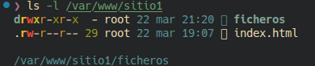

**Contenido de la carpeta `/var/www/sitio1/ficheros` con los archivos de texto creados:**  
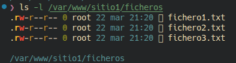

---

## 2. Configuración del VirtualHost para autenticación

Se configuró el VirtualHost para proteger la carpeta `ficheros` mediante autenticación básica.

**Fragmento del archivo de configuración con la directiva `<Directory>` para la autenticación:**  
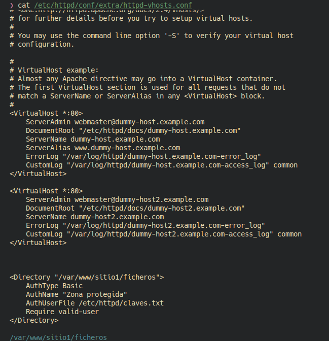

---

## 3. Creación del archivo de claves

Se generó el archivo `claves.txt` en `/etc/httpd` para almacenar las credenciales de los usuarios.

**Archivo `claves.txt` presente en `/etc/httpd`:**  
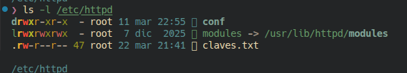

**Contenido de `claves.txt` con tres usuarios añadidos:**  
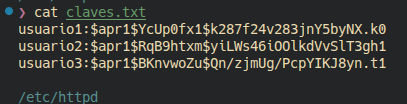

---

## 4. Gestión de usuarios en el archivo de claves

Se eliminó un usuario del archivo de claves y se comprobó el resultado.

**Contenido de `claves.txt` después de eliminar un usuario:**  
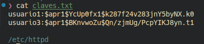

---

## 5. Recarga de Apache y acceso autenticado

Se recargó el servicio Apache y se accedió a la carpeta protegida desde el navegador.

**Estado del servicio Apache tras la recarga:**  
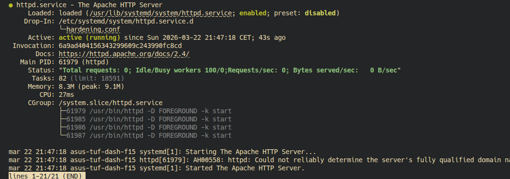

**Solicitud de autenticación al acceder a `/ficheros/`:**  
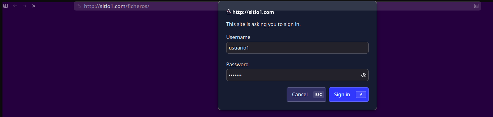

**Acceso exitoso mostrando el listado de archivos protegidos:**  
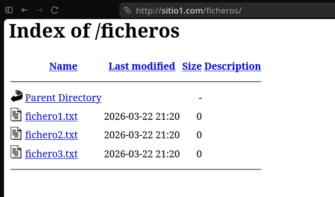

---

# Parte Segunda — Grupos

## 6. Ampliación de usuarios en `claves.txt`

Empleando `htpasswd` se amplió el fichero de claves hasta un total de **cuatro
usuarios** (`usuario1`, `usuario2`, `usuario3`, `usuario4`), cada uno con su
contraseña. El comando utilizado para añadir cada usuario fue:

```bash
sudo htpasswd -b /etc/httpd/claves.txt usuarioN claveN
```

La opción `-b` toma la contraseña directamente de la línea de comandos; se omite
`-c` deliberadamente para no recrear el fichero, sino actualizar/añadir entradas.

**Comando de adición de usuarios junto con el `cat` de `claves.txt` (4 usuarios):**  
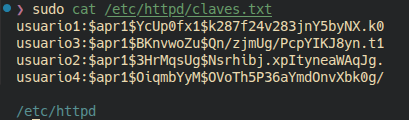

---

## 7. Creación del archivo de grupos `grupos.txt`

Se creó el fichero `/etc/httpd/grupos.txt` y se definieron **tres grupos**,
repartiendo los cuatro usuarios de forma que dos grupos tienen un único usuario
y un grupo tiene dos:

| Grupo | Usuarios |
|---|---|
| `grupoA` | `usuario1` |
| `grupoB` | `usuario2` |
| `grupoC` | `usuario3`, `usuario4` |

**Contenido de `grupos.txt` con los tres grupos definidos:**  
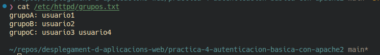

---

## 8. Activación del módulo de autenticación por grupos

El módulo encargado de trabajar con ficheros de grupo es
**`authz_groupfile_module`** (`mod_authz_groupfile`). En Ubuntu/Debian se
habilitaría con `a2enmod authz_groupfile`; en Arch/CachyOS se carga mediante la
directiva `LoadModule` del `httpd.conf` y se comprueba con `httpd -M`. En este
sistema el módulo ya estaba **activo por defecto**, como se verifica filtrando la
lista de módulos cargados:

```bash
sudo httpd -M 2>/dev/null | grep -i group
# authz_groupfile_module (shared)
```

**Comprobación de que el módulo de grupos está activado:**  
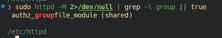

---

## 9. Modificación del `<Directory>` para autenticar por grupos

Se modificó la directiva `<Directory>` de la carpeta `ficheros` en el VirtualHost
`sitio1` para que la autorización se realice **por grupos** mediante
`AuthGroupFile` y `Require group`, dando acceso únicamente a **2 de los 3 grupos**
(`grupoA` y `grupoC`); `grupoB` queda excluido. Configuración resultante:

```apache
<Directory "/var/www/sitio1/ficheros">
    Options Indexes FollowSymLinks
    DirectoryIndex index.html
    AuthType Basic
    AuthName "Zona protegida"
    AuthUserFile /etc/httpd/claves.txt
    AuthGroupFile /etc/httpd/grupos.txt
    Require group grupoA grupoC
    AuthzSendForbiddenOnFailure On
</Directory>
```

La directiva `AuthzSendForbiddenOnFailure On` se añadió para que, cuando un
usuario se autentique correctamente pero **no pertenezca a un grupo autorizado**,
Apache devuelva un **403 Forbidden** explícito en lugar del `401` por defecto
(que volvería a pedir credenciales). Así la denegación por grupo se distingue con
claridad de un error de contraseña.

**Directiva `<Directory>` modificada para validación por grupos:**  
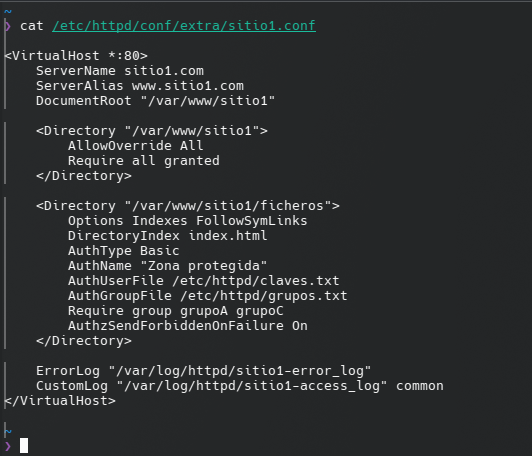

---

## 10. Recarga y comprobación del acceso por grupos

Tras recargar el servicio (`sudo systemctl reload httpd`) se comprobó que
solamente acceden los usuarios de los grupos autorizados. Verificación previa con
`curl` sobre `http://sitio1.com/ficheros/`:

| Usuario | Grupo | Código HTTP | Resultado |
|---|---|---|---|
| (sin login) | — | `401` | Pide autenticación |
| `usuario1` | `grupoA` | `200` | ✅ Acceso permitido |
| `usuario2` | `grupoB` | `403` | ❌ Autenticado pero **denegado** |
| `usuario3` | `grupoC` | `200` | ✅ Acceso permitido |
| `usuario4` | `grupoC` | `200` | ✅ Acceso permitido |

### Acceso permitido a un usuario de grupo autorizado (`usuario1` ∈ `grupoA`)

**Solicitud de login en el navegador con el usuario `usuario1`:**  


**Acceso concedido: listado de `/ficheros/` tras autenticarse `usuario1`:**  
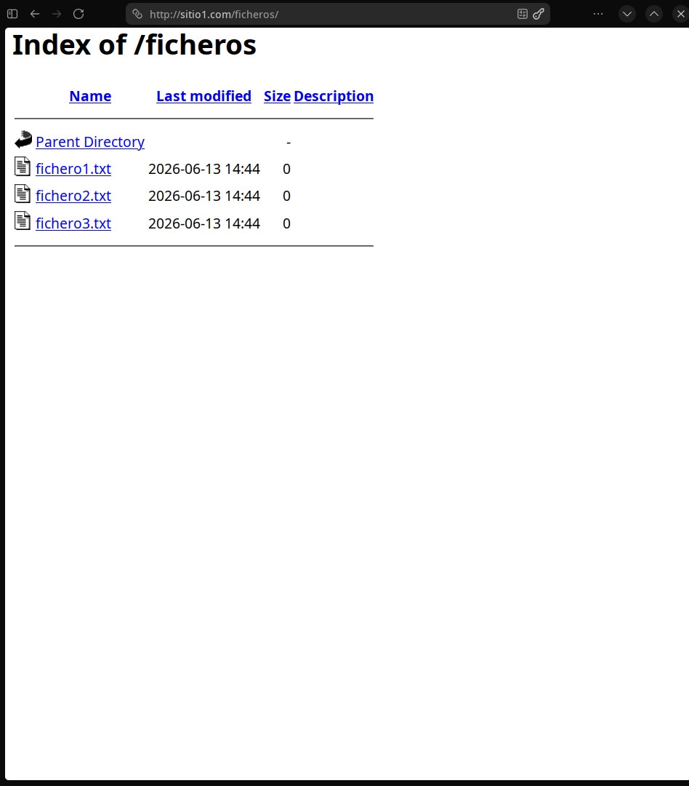

### Denegación a un usuario sin grupo autorizado (`usuario2` ∈ `grupoB`)

**Solicitud de login en el navegador con el usuario `usuario2` (credenciales
válidas):**  
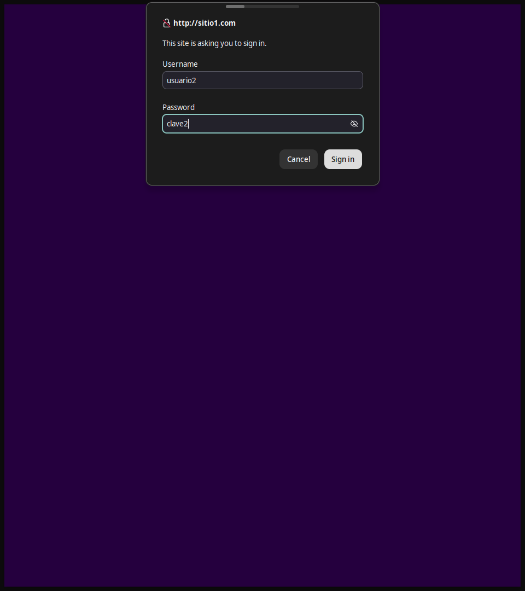

**Acceso denegado: a pesar de autenticarse correctamente, `usuario2` recibe un
`403 Access forbidden` porque `grupoB` no está entre los grupos autorizados:**  
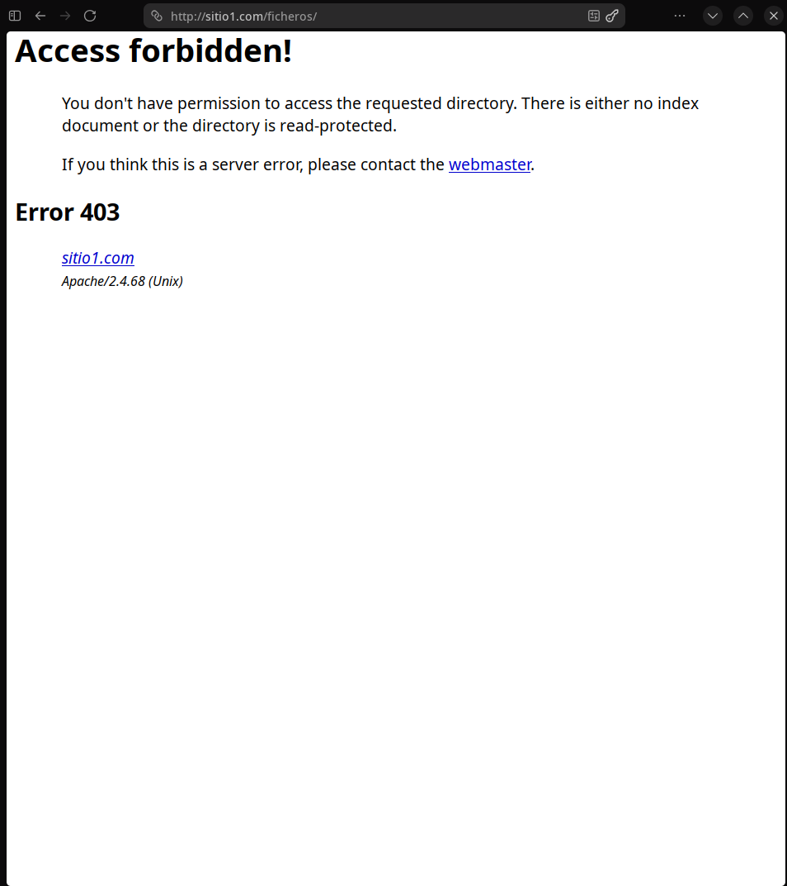

---
