> **Nota sobre el entorno**
>
> El enunciado está redactado para **Ubuntu/Debian** (`apt`, `/etc/apache2`,
> `sites-available`, `a2enmod`, MySQL, `libapache2-mod-php`). Esta práctica se ha
> realizado sobre **Arch Linux / CachyOS**, donde el servidor Apache se distribuye
> como `httpd` y los componentes LAMP tienen otra nomenclatura. Todos los paquetes
> necesarios están en el repositorio oficial `extra`. Equivalencias aplicadas:
>
> | Ubuntu/Debian (enunciado) | Arch / CachyOS (usado aquí) |
> |---|---|
> | `apt install awstats` | `pacman -S awstats` |
> | `/etc/awstats/awstats.conf` | `/etc/awstats/awstats.model.conf` (plantilla del paquete) |
> | cgi-bin de awstats | `/usr/share/webapps/awstats/cgi-bin/awstats.pl` |
> | iconos de awstats | `/usr/share/webapps/awstats/icon/` |
> | `a2enmod cgi` | descomentar `LoadModule cgi_module` en `httpd.conf` |
> | `/etc/apache2/sites-available/sitio1.conf` | `/etc/httpd/conf/extra/sitio1.conf` |
> | `apache2ctl -t` / `reload` | `apachectl -t` / `systemctl reload httpd` |
> | MySQL + `mysql_secure_installation` | **MariaDB** + `mariadb-secure-installation` |
> | `libapache2-mod-php` | `php-fpm` + `mod_proxy_fcgi` (mantiene el MPM `event`) |
> | `php-mysql` | extensiones `mysqli`/`pdo_mysql` incluidas en el paquete `php` |
> | phpMyAdmin en `/usr/share/phpmyadmin` | `/usr/share/webapps/phpMyAdmin` (con `Alias`) |
>
> Se parte del `sitio1` ya creado, protegido con autenticación básica por grupos
> (Práctica 4) y servido por HTTPS con certificado autofirmado (Práctica 5).

---

# Parte 1: herramienta AWStats

## 1. Instalación de AWStats y configuración para sitio1

Se instala AWStats desde el repositorio oficial:

```bash
sudo pacman -S awstats
```

**Comando de instalación de awstats:**
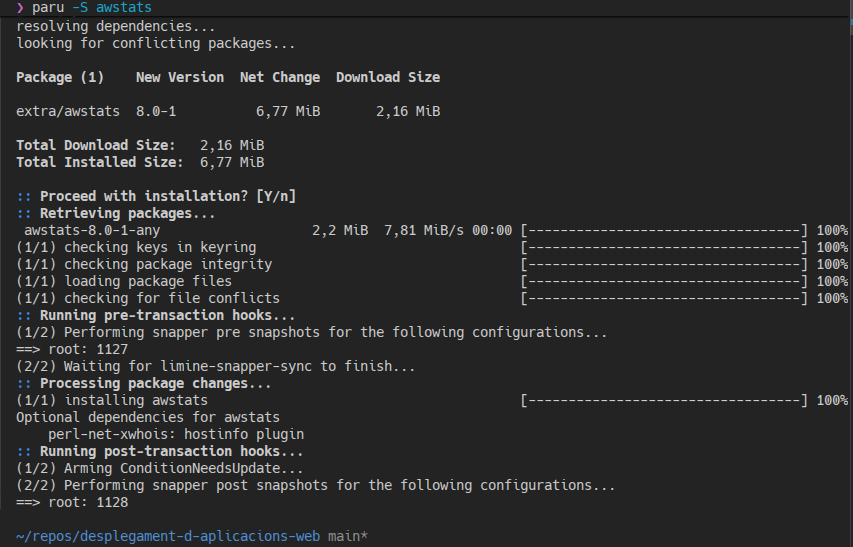

En Arch el paquete no incluye `awstats.conf`, sino la plantilla
`awstats.model.conf`. Se crea a partir de ella la copia para sitio1:

```bash
sudo cp /etc/awstats/awstats.model.conf /etc/awstats/awstats.sitio1.com.conf
```

**Copia realizada:**
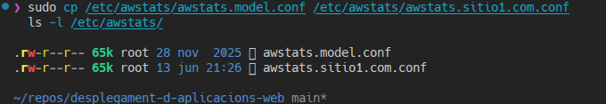

Se modifican en la copia los campos pedidos para que apunten a sitio1:

| Directiva | Valor | Motivo |
|---|---|---|
| `LogFile` | `/var/log/httpd/sitio1-ssl-access_log` | el access log que escribe el VirtualHost de sitio1 |
| `SiteDomain` | `sitio1.com` | dominio principal del sitio |
| `HostAliases` | `www.sitio1.com sitio1.com localhost 127.0.0.1` | todos los nombres del sitio, los mismos definidos en `/etc/hosts` |

(Además se fija `DirData="/var/lib/awstats"` para la base de datos de estadísticas
y `DirIcons="/awstatsicons"` para los iconos servidos por Apache, ver punto 4.)

**Configuración de LogFile, SiteDomain y HostAliases:**
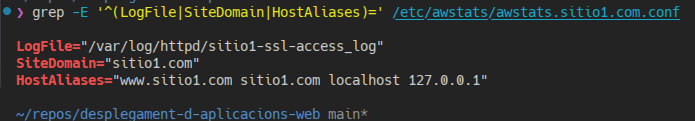

---

## 2. Primeras estadísticas con awstats.pl

AWStats (con `LogFormat=1`) espera el formato **combined**, pero el VirtualHost de
sitio1 venía registrando en formato `common` (Práctica 5). Para que AWStats parsee
correctamente, se cambia el formato del `CustomLog` de sitio1 a `combined` y se
reinicia Apache:

```bash
sudo sed -i 's|\(sitio1-ssl-access_log"\) common|\1 combined|' /etc/httpd/conf/extra/sitio1.conf
sudo systemctl restart httpd
```

El paquete de Arch necesita además el módulo Perl `JSON::XS`:

```bash
sudo pacman -S perl-json-xs
```

Se genera tráfico de prueba sobre sitio1 (HTTPS, certificado autofirmado → `-k`) y
se lanza la generación de estadísticas con `-update`, que parsea el log y guarda la
base de datos en `/var/lib/awstats`:

```bash
sudo /usr/share/webapps/awstats/cgi-bin/awstats.pl -config=sitio1.com -update
```

La salida confirma `Parsed lines in file: 20` y `Found 20 new qualified records`
(0 dropped / 0 corrupted), es decir, AWStats lee el log sin errores.

**Ejecución de awstats.pl y resultado:**
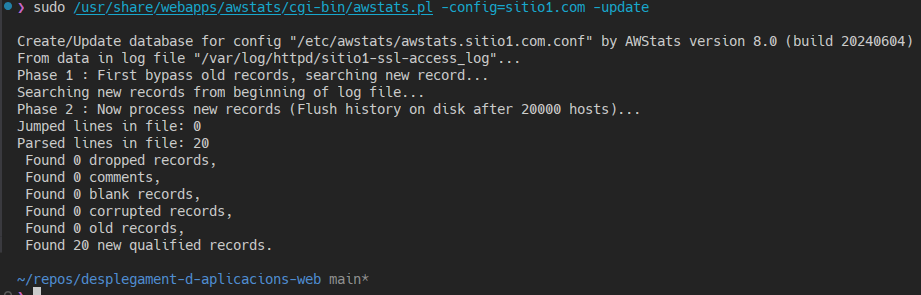

---

## 3. Activación del módulo CGI

AWStats se ejecuta como CGI. En Arch no existe `a2enmod`; se descomenta el
`LoadModule` correspondiente en `httpd.conf`. Como el MPM activo es **event**
(multihilo), el módulo correcto es **`cgid_module`** (`mod_cgid`), no `mod_cgi`
(este último es para el MPM `prefork`).

```bash
sudo sed -i 's|#LoadModule cgid_module|LoadModule cgid_module|' /etc/httpd/conf/httpd.conf
sudo systemctl restart httpd
httpd -M | grep cgi
```

`httpd -M` confirma `cgid_module (shared)`. El `restart` es necesario porque la
carga de un módulo nuevo no se aplica con un `reload` graceful.

**Activación del módulo CGI y reinicio:**
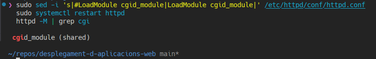

---

## 4. Configuración de AWStats en el VirtualHost de sitio1

Para acceder a `/awstats` por el navegador se añaden al VirtualHost `:443` de
sitio1 un `ScriptAlias` que ejecuta el CGI y un `Alias` para los iconos (este
último coincide con `DirIcons=/awstatsicons` del punto 1):

```apache
# --- AWStats (Practica 6): CGI de estadisticas + iconos ---
ScriptAlias /awstats/ "/usr/share/webapps/awstats/cgi-bin/"
Alias /awstatsicons "/usr/share/webapps/awstats/icon/"

<Directory "/usr/share/webapps/awstats/">
    Options +ExecCGI
    Require all granted
</Directory>
```

Además se añade `www.sitio1.com` a `/etc/hosts` (la URL de las estadísticas usa
`www`), de modo que coincide con el `HostAliases` definido en el punto 1.

```bash
echo "127.0.0.1   www.sitio1.com" | sudo tee -a /etc/hosts
sudo cp practica-6-estadisticas-y-lamp/sitio1.conf /etc/httpd/conf/extra/sitio1.conf
sudo apachectl -t
sudo systemctl reload httpd
```

**Bloque AWStats añadido al VirtualHost de sitio1:**
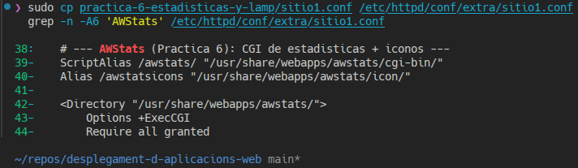

**Comprobación de sintaxis (`Syntax OK`) y recarga:**
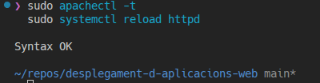

---

## 5. Acceso web a las estadísticas y peticiones con ab

Se accede desde el navegador a la URL de las estadísticas (certificado
autofirmado → se acepta el riesgo):

```
https://www.sitio1.com/awstats/awstats.pl?config=sitio1.com
```

La página muestra el estado inicial: **20 Pages / 20 Hits / 840 Bytes** y 0
visitantes (solo las peticiones de prueba del punto 2).

**Página de AWStats antes de las peticiones:**
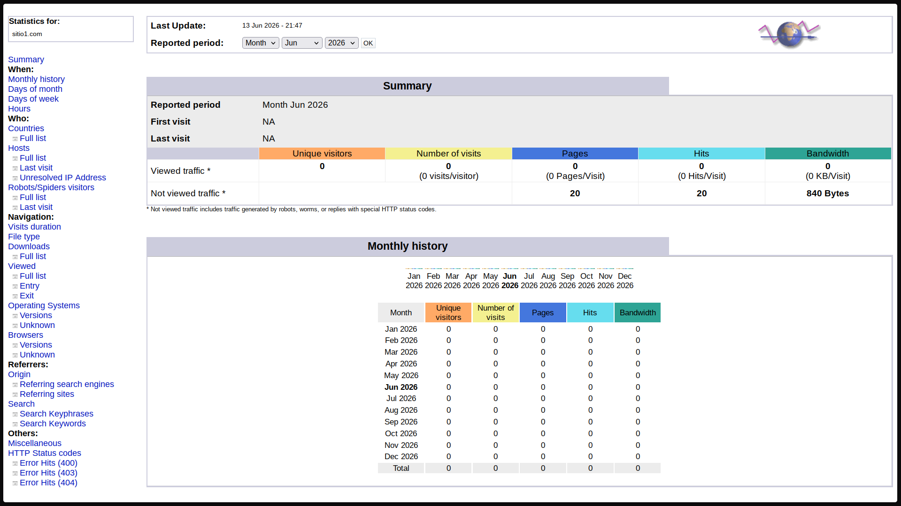

Se lanzan las peticiones con `ab` (Apache Benchmark) sobre sitio1 por HTTPS:

```bash
ab -n 5000 -c 10 https://www.sitio1.com/
```

`-n` es el número total de peticiones y `-c` la concurrencia. La salida confirma
`Complete requests` y `Failed requests: 0`.

**Ejecución de ab:**
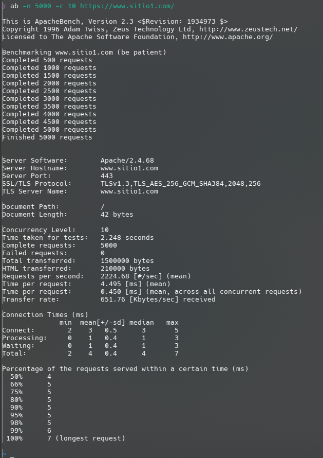

Se vuelve a ejecutar el script para actualizar la base de datos con las nuevas
líneas del log:

```bash
sudo /usr/share/webapps/awstats/cgi-bin/awstats.pl -config=sitio1.com -update
```

Al recargar la página, las estadísticas se disparan: **>10 000 Pages/Hits**,
**~491 KB** de Bandwidth y **1 visitante único**.

**Página de AWStats después de las peticiones:**
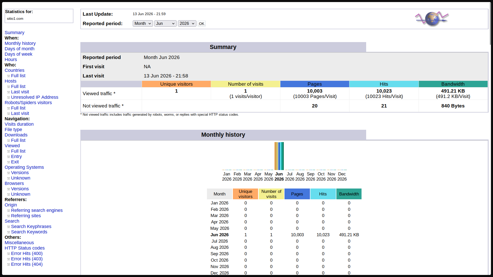

**¿Qué ha cambiado?** Pages y Hits pasan de 20 a más de diez mil, y el Bandwidth
de 840 bytes a ~491 KB, reflejando el aluvión de peticiones generadas por `ab`.
En cambio, los **visitantes únicos** suben solo de 0 a **1**: como todas las
peticiones proceden de la misma IP (`127.0.0.1`), AWStats las agrupa en un único
visitante y una única visita. Es decir, AWStats distingue entre *volumen de
tráfico* (hits/páginas/bytes, que crece muchísimo) y *visitantes distintos* (que
sigue siendo uno, porque el origen es siempre el mismo).

---

## 6. Actualización automática con crontab cada 3 horas

En Arch el demonio de cron no viene de serie; se instala `cronie` y se habilita el
servicio:

```bash
sudo pacman -S cronie
sudo systemctl enable --now cronie
```

Como la actualización se ejecuta como root, se edita el crontab de root añadiendo
una entrada que lanza el script cada 3 horas:

```bash
echo "0 */3 * * * /usr/share/webapps/awstats/cgi-bin/awstats.pl -config=sitio1.com -update >/dev/null 2>&1" | sudo crontab -
sudo crontab -l
```

Significado de `0 */3 * * *`: minuto `0`, cada 3 horas (`*/3`), todos los días.
`>/dev/null 2>&1` descarta la salida para que cron no envíe correo.

**Entrada introducida en el crontab:**
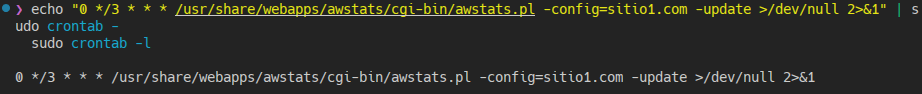

---

# Parte 2: Completar la pila LAMP

## 7. Instalación de MariaDB (MySQL) y aseguramiento

En Arch, «MySQL» se cubre con **MariaDB** (compatible; `mysql_secure_installation`
→ `mariadb-secure-installation`). Se instala, se inicializan las tablas de sistema
(paso manual en Arch) y se arranca el servicio:

```bash
sudo pacman -S mariadb
sudo mariadb-install-db --user=mysql --basedir=/usr --datadir=/var/lib/mysql
sudo systemctl enable --now mariadb
```

**Instalación de MariaDB:**
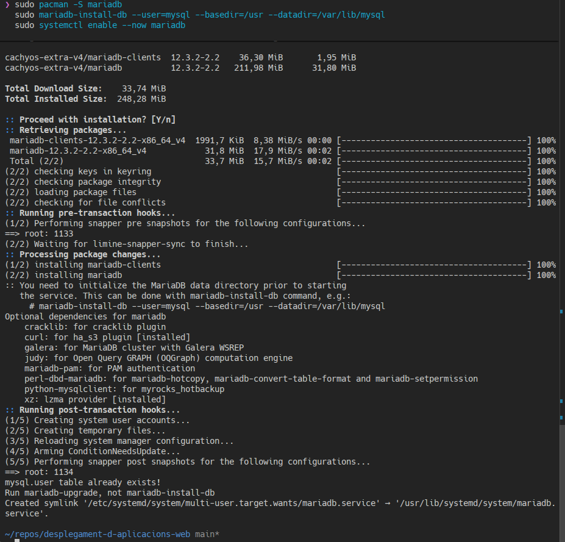

Se entra en el cliente (root accede por *unix_socket*) y se establece la
contraseña de `'root'@'localhost'`:

```sql
sudo mariadb
ALTER USER 'root'@'localhost' IDENTIFIED BY 'MiClaveRoot';
FLUSH PRIVILEGES;
EXIT;
```

**Cambio de contraseña para `'root'@'localhost'`:**
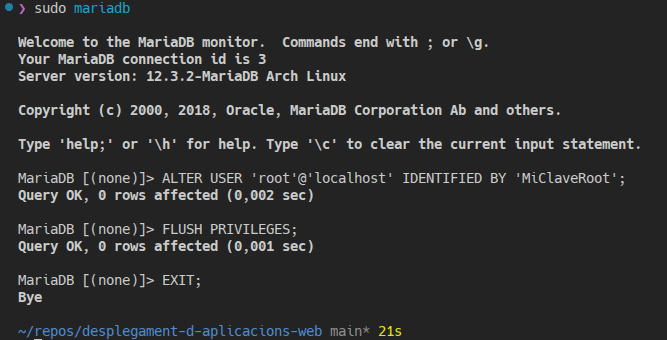

Por último, desde `/var/www/sitio1`, se ejecuta el aseguramiento, que elimina
usuarios anónimos, deshabilita el login remoto de root y borra la base `test`:

```bash
cd /var/www/sitio1
sudo mariadb-secure-installation
```

**Ejecución de mariadb-secure-installation:**
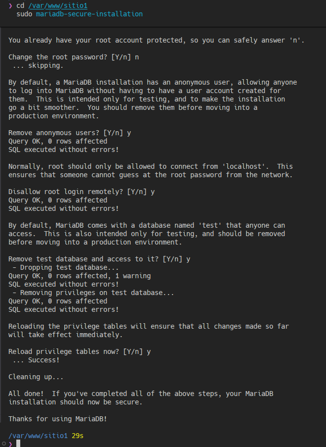

---

## 8. Instalación de PHP

En Arch no existen los paquetes `libapache2-mod-php` ni `php-mysql`. El módulo PHP
para Apache se sustituye por **php-fpm + mod_proxy_fcgi** (mantiene el MPM `event`),
y los controladores MySQL (`mysqli`, `pdo_mysql`) son extensiones ya incluidas en
el paquete `php`. Desde `/var/www/sitio1` se instala PHP y php-fpm, se habilita
`mysqli` en `php.ini` (`pdo_mysql` ya lo activa el drop-in
`/etc/php/conf.d/20-pdo_mysql.ini`) y se arranca el servicio:

```bash
cd /var/www/sitio1
sudo pacman -S php php-fpm
sudo sed -i 's|^;extension=mysqli|extension=mysqli|' /etc/php/php.ini
sudo systemctl enable --now php-fpm
```

**Instalación de PHP y php-fpm:**
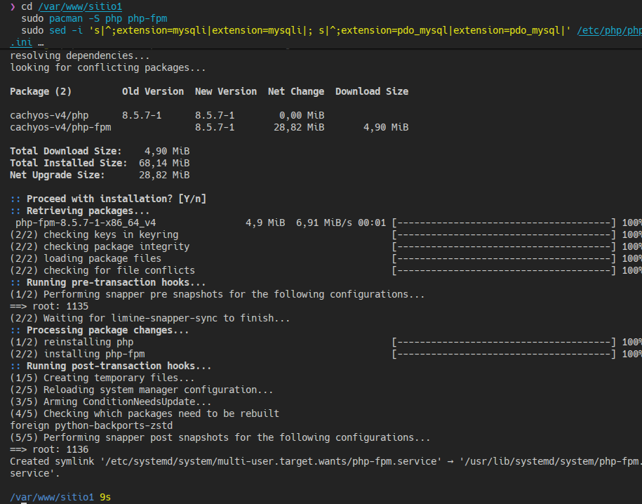

Se activan los módulos `proxy` y `proxy_fcgi` de Apache y se aplica el `sitio1.conf`
con el bloque `<FilesMatch \.php$>` que envía los `.php` al socket de php-fpm:

```bash
sudo sed -i 's|#LoadModule proxy_module|LoadModule proxy_module|; s|#LoadModule proxy_fcgi_module|LoadModule proxy_fcgi_module|' /etc/httpd/conf/httpd.conf
sudo cp practica-6-estadisticas-y-lamp/sitio1.conf /etc/httpd/conf/extra/sitio1.conf
sudo apachectl -t
sudo systemctl restart httpd
```

```apache
DirectoryIndex index.php index.html
<FilesMatch \.php$>
    SetHandler "proxy:unix:/run/php-fpm/php-fpm.sock|fcgi://localhost/"
</FilesMatch>
```

Se comprueba la instalación: versión de PHP, controladores MySQL cargados y módulo
de Apache para FastCGI:

```bash
php -v
php -m | grep -E 'mysqli|pdo_mysql'
httpd -M | grep proxy_fcgi
```

**`php -v` y comprobación de extensiones MySQL y proxy_fcgi:**
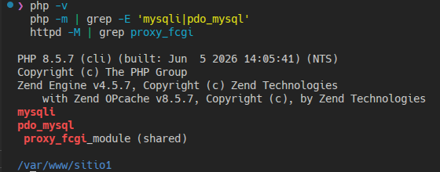

---

## 9. Fichero prueba.php con phpinfo()

Se crea `prueba.php` en el DocumentRoot de sitio1 con la información de PHP
(`/var/www/sitio1` pertenece al usuario `http`, por eso `sudo tee`):

```bash
echo '<?php phpinfo(); ?>' | sudo tee /var/www/sitio1/prueba.php
cat /var/www/sitio1/prueba.php
```

**Código de prueba.php:**
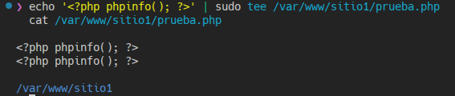

Al acceder a `https://www.sitio1.com/prueba.php` se muestra la tabla de `phpinfo()`
(PHP 8.5.7), confirmando que php-fpm procesa los `.php` de sitio1:

**`https://www.sitio1.com/prueba.php` en el navegador:**
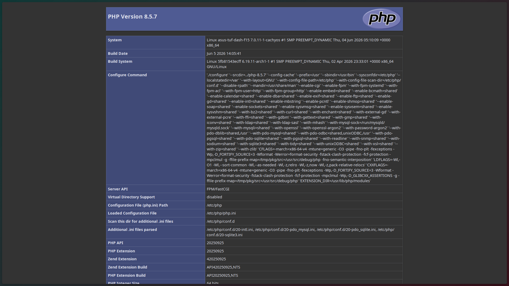

---

## 10. Instalación de phpMyAdmin

De las extensiones pedidas (`mbstring`, `zip`, `gd`, `json`, `curl`), en Arch solo
falta `gd` (paquete `php-gd`); `mbstring` y `json` están compiladas en el binario y
`zip`/`curl` ya activadas. Se instala phpMyAdmin y `php-gd` y se activa `gd`:

```bash
sudo pacman -S phpmyadmin php-gd
sudo sed -i 's|^;extension=gd|extension=gd|' /etc/php/php.ini
sudo systemctl restart php-fpm
```

**Instalación de phpMyAdmin:**
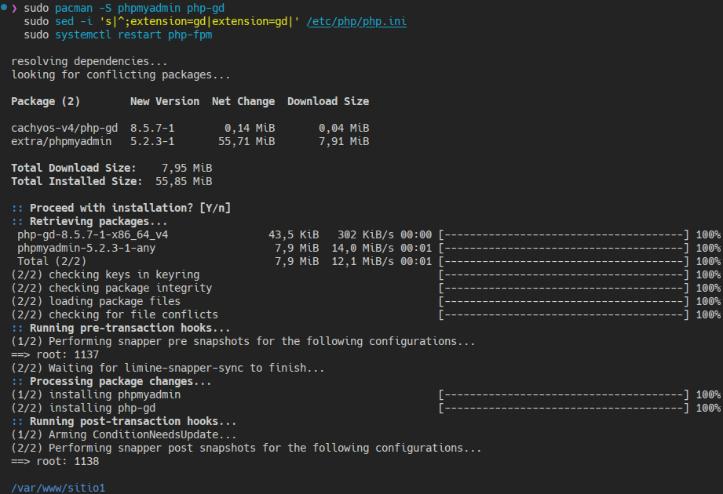

En Arch la configuración de conexión a la base de datos (equivalente al
`config-db.php` de Debian) es `/etc/webapps/phpmyadmin/config.inc.php`. Se rellena
el `blowfish_secret` (obligatorio para la autenticación por cookie) y se fija un
`TempDir` escribible (`/tmp`, porque el servicio php-fpm monta `/usr` en solo
lectura):

```bash
sudo sed -i "s|blowfish_secret'] = ''|blowfish_secret'] = 'a1b2c3d4e5f6g7h8i9j0k1l2m3n4o5p6'|" /etc/webapps/phpmyadmin/config.inc.php
printf '%s\n' "\$cfg['TempDir'] = '/tmp';" | sudo tee -a /etc/webapps/phpmyadmin/config.inc.php
```

**Configuración de phpMyAdmin (`config.inc.php`, equivalente a config-db.php):**
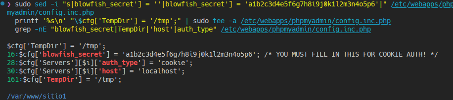

Para acceder por `/phpmyadmin` se añade al VirtualHost de sitio1 un `Alias`
(en Arch los ficheros están en `/usr/share/webapps/phpMyAdmin`):

```apache
Alias /phpmyadmin "/usr/share/webapps/phpMyAdmin"
<Directory "/usr/share/webapps/phpMyAdmin">
    DirectoryIndex index.php
    Require all granted
</Directory>
```

```bash
sudo cp practica-6-estadisticas-y-lamp/sitio1.conf /etc/httpd/conf/extra/sitio1.conf
sudo apachectl -t
sudo systemctl reload httpd
```

**Configuración del Alias /phpmyadmin en sitio1.conf:**
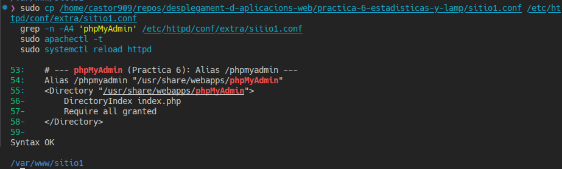

Al intentar entrar como `root`, phpMyAdmin devuelve el error
`mysqli::real_connect(): (HY000/1698): Access denied for user 'root'@'localhost'`.
La causa es que `root@localhost` se autentica con el plugin **`unix_socket`** (por
el usuario del sistema), no por contraseña; por eso `sudo mariadb` funciona pero un
acceso por contraseña (como el de phpMyAdmin) se rechaza. Se configura `root` para
que admita **ambos** métodos, conservando el acceso por socket:

```sql
sudo mariadb
ALTER USER 'root'@'localhost' IDENTIFIED VIA unix_socket OR mysql_native_password USING PASSWORD('MiClaveRoot');
FLUSH PRIVILEGES;
EXIT;
```

Tras esto, el login `root` / contraseña en
`https://www.sitio1.com/phpmyadmin` entra correctamente, mostrando el panel con las
bases de datos, MariaDB 12.3 y PHP 8.5.7:

**phpMyAdmin tras hacer login:**
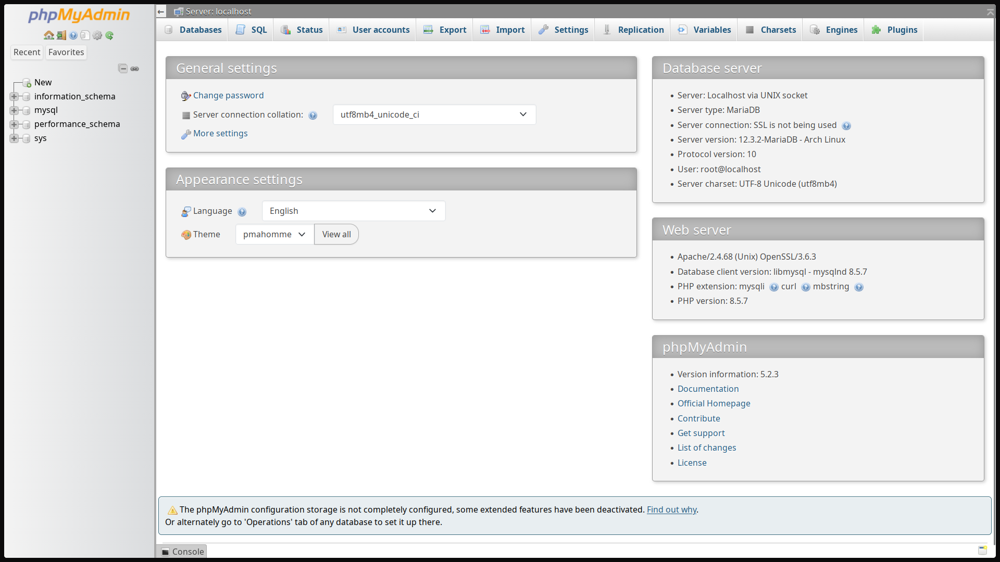
