> **Nota sobre el entorno**
>
> La práctica se ha realizado sobre la máquina virtual **`my_ubuntu_server`**
> (Ubuntu 24.04 LTS), accedida por SSH desde el host (`castor909@192.168.1.178`).
> Durante la ejecución se detectaron dos particularidades del entorno que se
> resolvieron de forma documentada:
>
> | Situación encontrada | Decisión aplicada |
> |---|---|
> | El puerto **3000** ya estaba ocupado por un contenedor **Gitea** existente (`docker-proxy` en `0.0.0.0:3000`). | La API se publica en el puerto **3001**; el `proxy_pass` de Nginx apunta a `127.0.0.1:3001`. Gitea sigue operativo. |
> | El puerto **80** estaba servido por **Apache2**, no por Nginx (Nginx estaba `disabled`/`inactive`). | Se detuvo y deshabilitó Apache2 y se habilitó/arrancó **Nginx**, que pasa a ser el reverse proxy en `:80` tal como exige la práctica. |
>
> El resto de la práctica sigue el enunciado de forma literal.

---

## 1. Comprobación del entorno

Tras conectar por SSH a la VM se documentan las versiones de las herramientas y el
estado del servicio heredado de la Práctica 7:

```bash
node -v
npm -v
nginx -v
systemctl status nodeapp
```

Resultado: `node v24.15.0`, `npm 11.12.1`, `nginx/1.24.0 (Ubuntu)`. El servicio
`nodeapp` (servidor de desarrollo Angular de la Práctica 7) existe y está cargado.

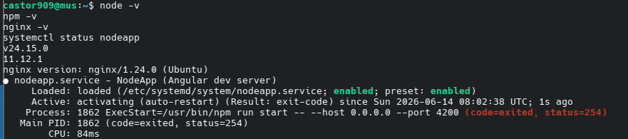

---

## 2. Creación del backend (API)

Se crea el directorio del backend con propietario `nodeapp`, se inicializa el
proyecto Node y se instala Express:

```bash
sudo mkdir -p /opt/nodeapp/api
sudo chown -R nodeapp:nodeapp /opt/nodeapp
cd /opt/nodeapp/api
sudo -u nodeapp npm init -y
sudo -u nodeapp npm install express
```

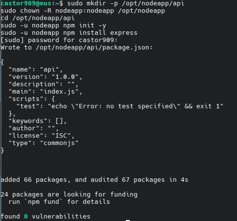

Se crea `server.js` con el endpoint `GET /api/hola`. Se usa el puerto **3001**
(el 3000 está ocupado por Gitea). La ruta es `/api/hola` porque Nginx hará
`proxy_pass` sin reescribir el path, reenviando la URL completa al backend.

```bash
sudo -u nodeapp tee /opt/nodeapp/api/server.js > /dev/null << 'EOF'
const express = require('express');
const app = express();
const PORT = 3001;

app.get('/api/hola', (req, res) => {
  res.send('Hola desde la API');
});

app.listen(PORT, () => {
  console.log(`API escuchando en http://localhost:${PORT}`);
});
EOF
cat /opt/nodeapp/api/server.js
```

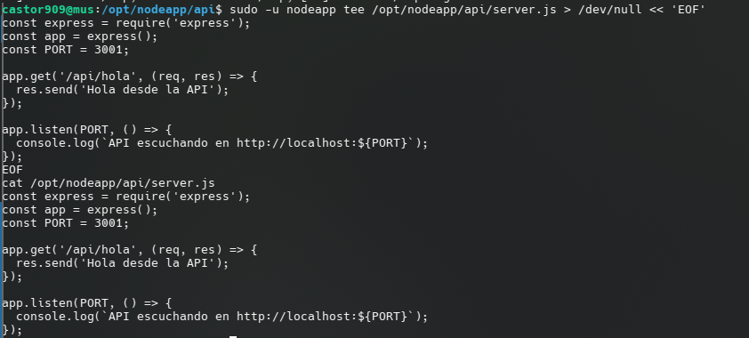

Prueba local del endpoint:

```bash
cd /opt/nodeapp/api
sudo -u nodeapp node server.js &
sleep 1
curl http://localhost:3001/api/hola
```

La API responde `Hola desde la API`. Tras la prueba se detiene el proceso
(`kill %1`) para liberar el puerto.

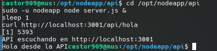

---

## 3. Servicio systemd para la API

Se crea la unidad `/etc/systemd/system/nodeapp-api.service`, que ejecuta el
backend como usuario `nodeapp`, desde `/opt/nodeapp/api`, y lo reinicia
automáticamente si falla (`Restart=on-failure`):

```bash
NODE=$(which node)
sudo tee /etc/systemd/system/nodeapp-api.service > /dev/null << EOF
[Unit]
Description=NodeApp API (backend Express)
After=network.target

[Service]
User=nodeapp
WorkingDirectory=/opt/nodeapp/api
ExecStart=$NODE server.js
Restart=on-failure
RestartSec=3

[Install]
WantedBy=multi-user.target
EOF
cat /etc/systemd/system/nodeapp-api.service
```

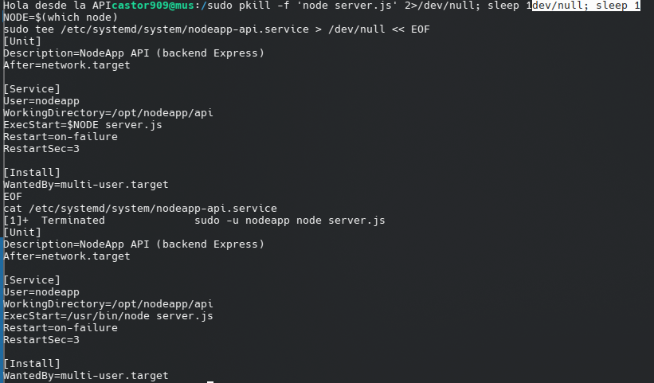

Se activa y arranca el servicio:

```bash
sudo systemctl daemon-reload
sudo systemctl enable nodeapp-api
sudo systemctl start nodeapp-api
sudo systemctl status nodeapp-api
```

El servicio queda `active (running)` y habilitado en el arranque.

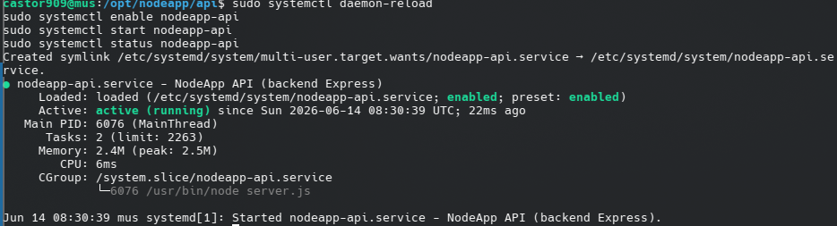

Consulta de los logs del servicio:

```bash
sudo journalctl -u nodeapp-api --no-pager -n 20
```

Los logs muestran `Started nodeapp-api.service` y
`API escuchando en http://localhost:3001`.

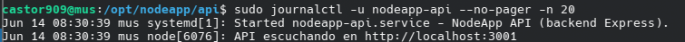

---

## 4. Publicación mediante Nginx

En `/etc/nginx/sites-available/default` se añade, dentro del bloque `server`, un
`location /api/` que proxifica hacia el backend (puerto 3001). Se hace copia de
seguridad previa del fichero:

```bash
sudo cp /etc/nginx/sites-available/default /etc/nginx/sites-available/default.bak
sudo tee /etc/nginx/sites-available/default > /dev/null << 'EOF'
server {
    listen 80 default_server;
    listen [::]:80 default_server;

    root /var/www/html;
    index index.html index.htm index.nginx-debian.html;

    server_name _;

    location / {
        try_files $uri $uri/ =404;
    }

    location /api/ {
        proxy_pass http://127.0.0.1:3001;
    }
}
EOF
cat /etc/nginx/sites-available/default
```

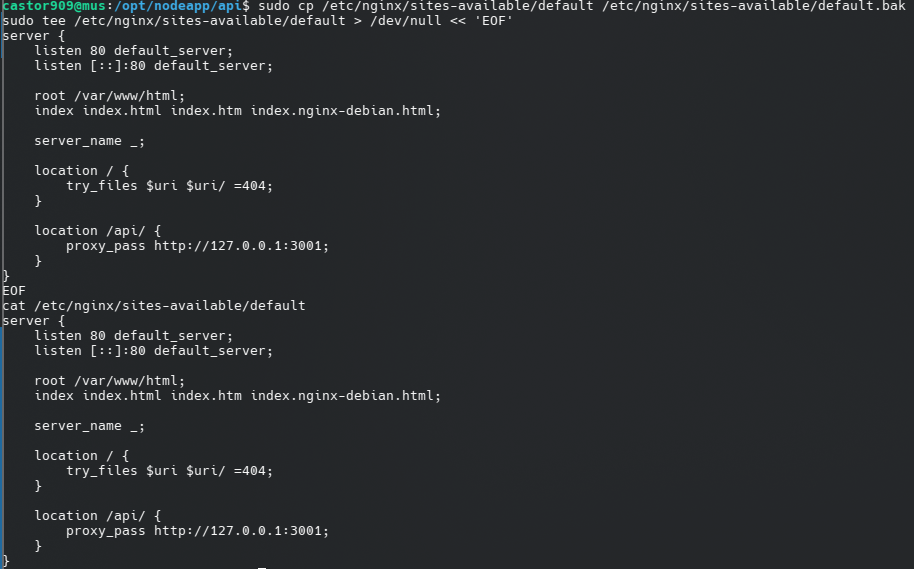

Como el puerto 80 estaba servido por Apache2, se conmuta el servidor web a Nginx
(deteniendo Apache y habilitando Nginx) y se valida la configuración:

```bash
sudo systemctl stop apache2
sudo systemctl disable apache2
sudo systemctl enable nginx
sudo systemctl start nginx
sudo nginx -t
sudo systemctl status nginx
```

`nginx -t` devuelve `syntax is ok` / `test is successful` y Nginx queda
`active (running)` sirviendo el puerto 80.

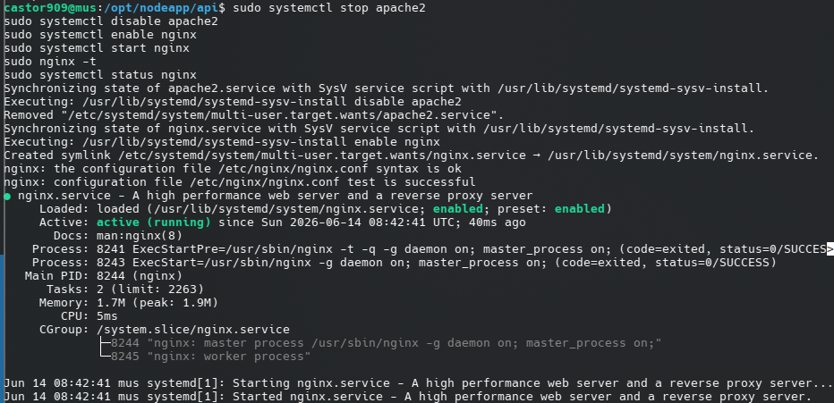

Prueba desde el navegador del host a través del reverse proxy:

```
http://192.168.1.178/api/hola
```

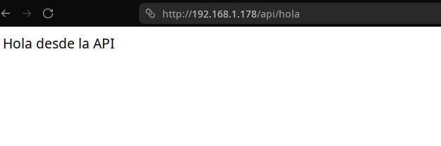

---

## 5. Actualización del backend (versión 2)

Se modifica la API: se añade el endpoint `/api/hola2` y se actualiza el mensaje de
`/api/hola` para evidenciar la nueva versión:

```bash
sudo -u nodeapp tee /opt/nodeapp/api/server.js > /dev/null << 'EOF'
const express = require('express');
const app = express();
const PORT = 3001;

app.get('/api/hola', (req, res) => {
  res.send('Hola desde la API (v2)');
});

app.get('/api/hola2', (req, res) => {
  res.send('Hola desde la API - segundo endpoint (v2)');
});

app.listen(PORT, () => {
  console.log(`API escuchando en http://localhost:${PORT}`);
});
EOF
cat /opt/nodeapp/api/server.js
```

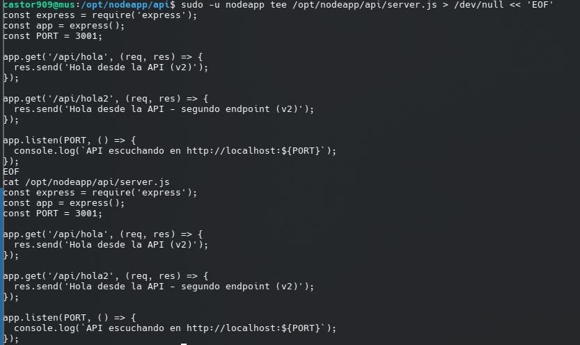

Se empaqueta la aplicación:

```bash
cd /opt/nodeapp
sudo -u nodeapp tar -czvf nodeapp-api-v2.tar.gz api/
ls -lh nodeapp-api-v2.tar.gz
```

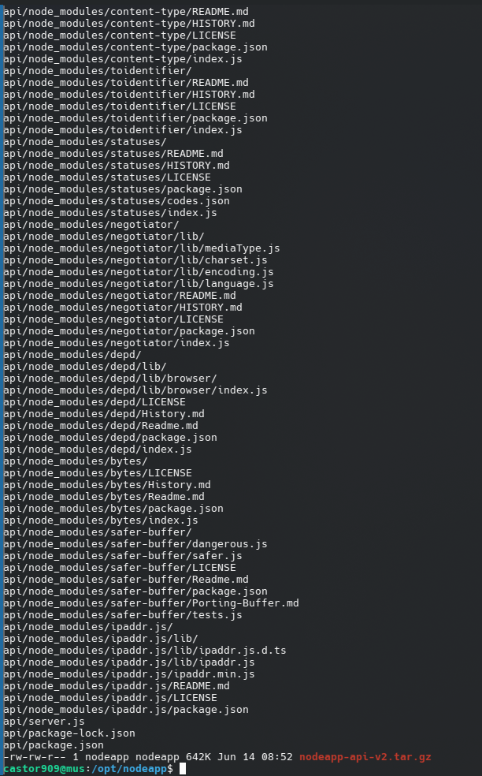

Despliegue de la nueva versión: no hay dependencias nuevas, por lo que no es
necesario `npm install`; basta con reiniciar el servicio:

```bash
sudo systemctl restart nodeapp-api
sudo systemctl status nodeapp-api --no-pager | head -5
curl http://localhost:3001/api/hola
curl http://localhost:3001/api/hola2
```

El servicio responde con la nueva versión en ambos endpoints:
`Hola desde la API (v2)` y `Hola desde la API - segundo endpoint (v2)`.

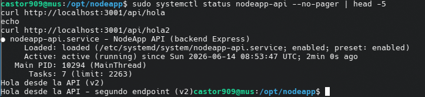

Comprobación del nuevo endpoint desde el navegador a través de Nginx:

```
http://192.168.1.178/api/hola2
```

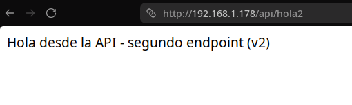

---

## Conclusión

Sobre la infraestructura de la Práctica 7 se ha desplegado un backend Express que
expone `/api/hola` y `/api/hola2`, gestionado por un servicio systemd
(`nodeapp-api`) con reinicio automático, y publicado al exterior mediante Nginx
como reverse proxy en el puerto 80. Se ha demostrado además el ciclo de
actualización y redespliegue de una nueva versión de la aplicación.
