> **Nota sobre el entorno**
>
> El servidor FTP (vsftpd) se ha instalado sobre la máquina virtual
> **Ubuntu 24.04** (`192.168.1.178`), y el cliente **FileZilla** sobre la máquina
> host. El enunciado indica FileZilla en Windows; aquí el host es **Arch/CachyOS**,
> por lo que se ha usado la versión Linux de FileZilla (idéntica en
> funcionamiento). Durante la práctica se aplicaron algunos ajustes de entorno
> necesarios, documentados en su punto correspondiente:
>
> - vsftpd en Ubuntu escucha por defecto solo en IPv6; se fijó `listen=YES` /
>   `listen_ipv6=NO` para aceptar conexiones IPv4.
> - El cortafuegos `ufw` de la VM bloqueaba el FTP; se abrieron los puertos `21`,
>   `20` y el rango pasivo `4500:6000`.
> - El puerto `3000` (sugerido en otros contextos) no interviene aquí; el rango
>   pasivo se fijó en `4500-6000` según el enunciado.

---

## 1. Instalación de vsftpd (VM) y FileZilla (host)

En la VM se instala el servidor **vsftpd**:

```bash
sudo apt update
sudo apt install -y vsftpd
sudo systemctl status vsftpd
```

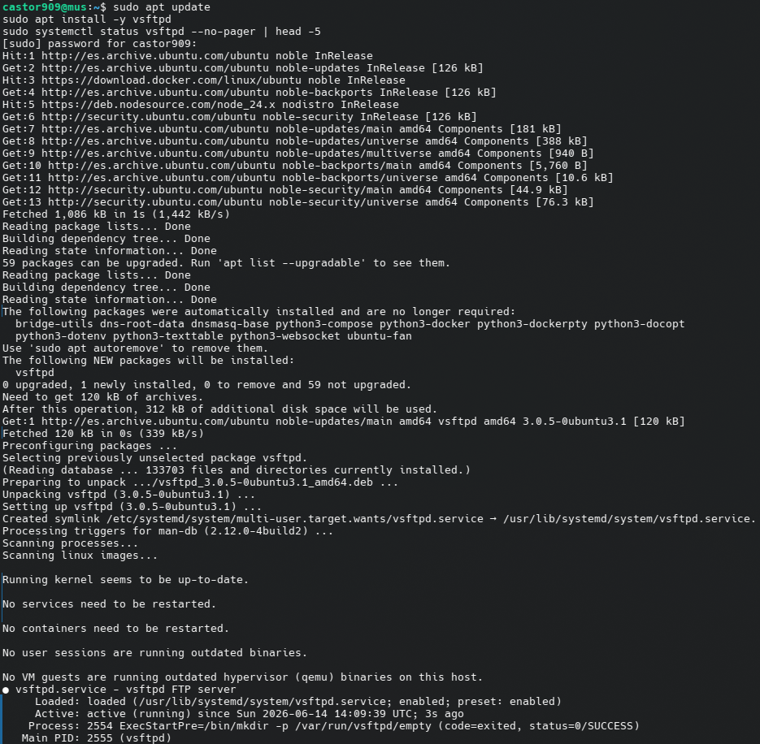

En el host se instala y abre el cliente **FileZilla**:

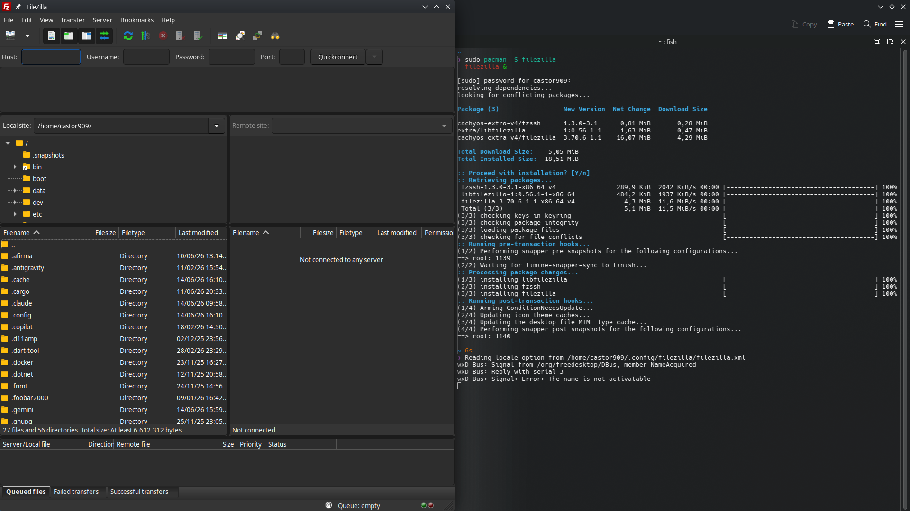

---

## 2. Acceso como root y comprobación de permisos

Para permitir el acceso de root por FTP se ajustó el entorno (necesario en Ubuntu):
se habilitó la escucha IPv4 (`listen=YES`, `listen_ipv6=NO`), se retiró `root` de
`/etc/ftpusers`, se asignó contraseña a root y se reinició el servicio. Con la
configuración por defecto (`write_enable` aún desactivado) se comprueba que root:

- **puede navegar** por el árbol de directorios,
- **no puede subir** un archivo (`550 Permission denied`),
- **no puede crear** carpetas (`550 Permission denied`).

> Nota: el enunciado esperaba que root pudiera subir un archivo; en la práctica,
> con la configuración por defecto la escritura está deshabilitada, por lo que
> tanto la subida como la creación de carpeta devuelven `550`. La escritura se
> habilita en el paso 4.

**Navegación por el árbol de directorios:**  
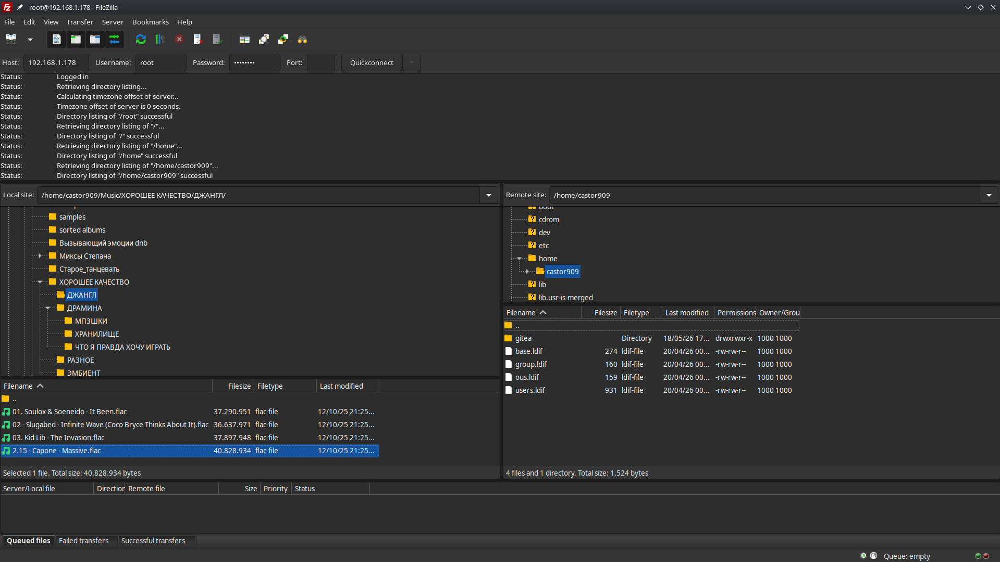

**Intento de subida de archivo (550):**  
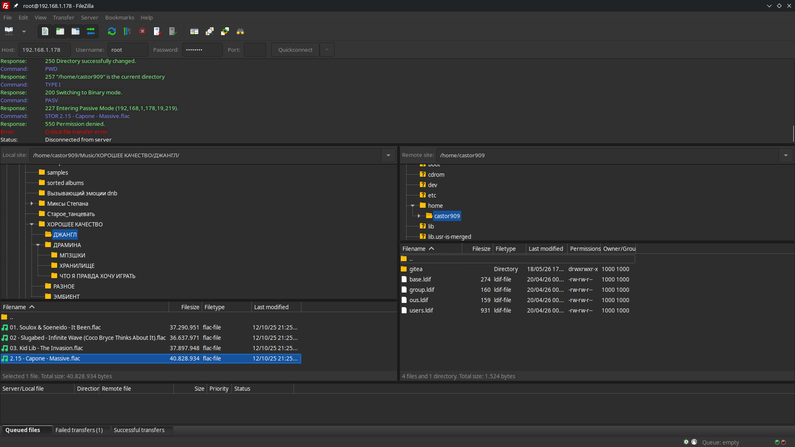

**Intento de crear carpeta (550):**  
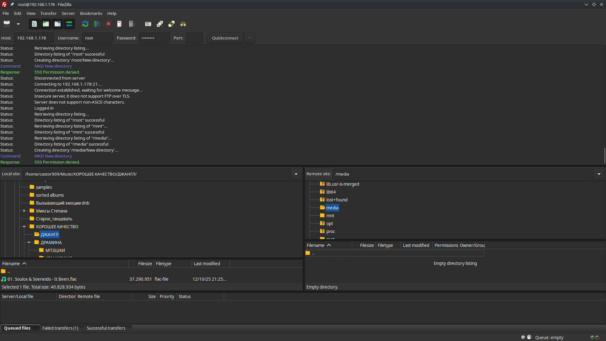

---

## 3. Creación del usuario `daw_user`

Se crea el usuario con su directorio home propio y se le asigna contraseña:

```bash
sudo useradd -d /home/daw_user -m daw_user
ls -la /home
sudo passwd daw_user
```

La opción `-d` define el home y `-m` lo crea. Se verifica que `/home/daw_user`
existe y pertenece a `daw_user`, y se asigna la contraseña `password`.

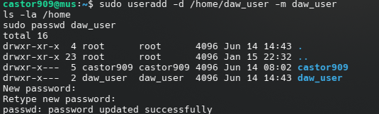

> Ajuste necesario: `useradd` dejó un shell no válido para FTP; vsftpd (vía
> `pam_shells`) requiere un shell listado en `/etc/shells`. Se asignó
> `sudo usermod -s /bin/bash daw_user` para permitir el login FTP.

Conectando con `daw_user` mediante FileZilla se comprueba que **navega** por el
árbol pero **no puede subir ni crear carpetas** (`550`, escritura aún desactivada):

**daw_user conectado y navegando:**  
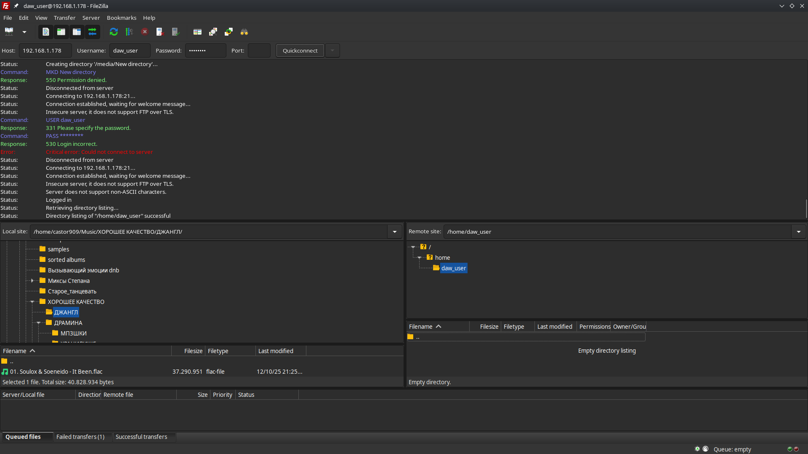

**daw_user: escritura denegada (550):**  
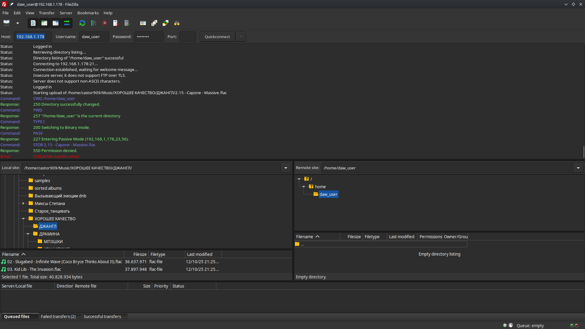

---

## 4-6. Configuración de `vsftpd.conf` (anónimos, escritura, chroot, banner, puertos)

Siguiendo la indicación del enunciado, los pasos 4, 5 y 6 se realizan juntos y se
reinicia una sola vez en el paso 7. Se añadieron al final de `/etc/vsftpd.conf`
las directivas (vsftpd toma el último valor de cada parámetro):

```apache
anonymous_enable=YES          # paso 4: permitir anónimos
write_enable=YES              # paso 4: permitir subir ficheros
chroot_local_user=YES         # paso 5: enjaular usuarios en su home
allow_writeable_chroot=YES    # paso 5: permitir chroot sobre home escribible
chroot_list_enable=YES        # paso 5: activar lista de excepciones
chroot_list_file=/etc/vsftpd.chroot_list
ftpd_banner=Bienvenido al servidor FTP de DAW   # paso 6
pasv_min_port=4500            # paso 6: rango pasivo
pasv_max_port=6000
```

**Lógica del chroot:** `chroot_local_user=YES` enjaula a *todos* los usuarios
locales en su home; `chroot_list_file` es la lista de **excepciones**, donde se
introduce **root** para que sea el único que pueda navegar por todo el árbol.

**Directivas en `/etc/vsftpd.conf` y `/etc/vsftpd.chroot_list` (con root):**  
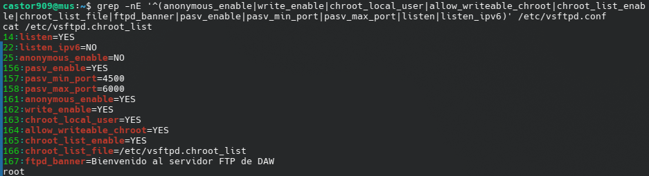

---

## 7. Reinicio del servicio y comprobaciones

```bash
sudo systemctl restart vsftpd
```

**a) Se pueden conectar usuarios anónimos:**  
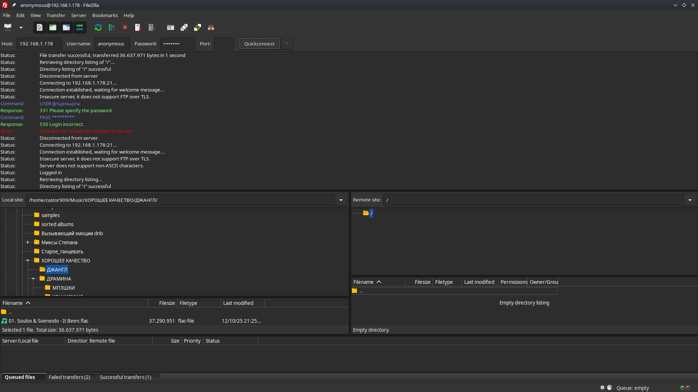

**b) Los usuarios con credenciales pueden subir ficheros y crear carpetas**
(ya con `write_enable=YES`):  
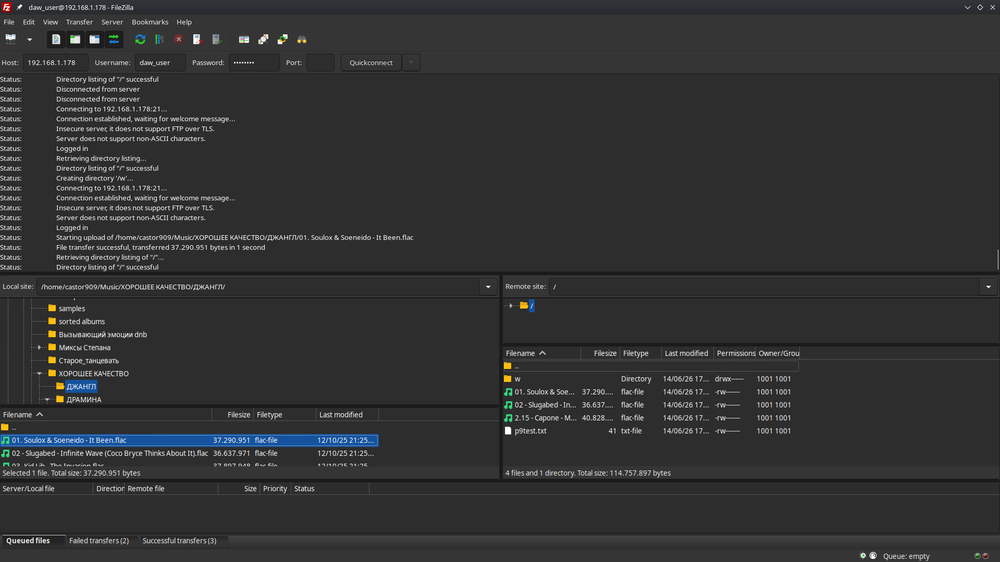

**c) Los usuarios no pueden navegar por el árbol, excepto root.**

`daw_user` queda enjaulado: su raíz `/` es realmente su home:  
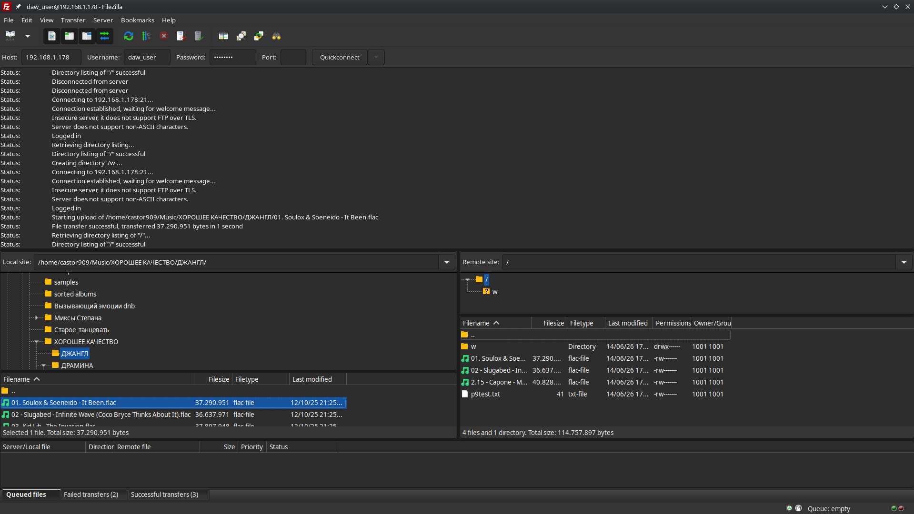

`root` (en `chroot_list`) navega por todo el árbol de la VM:  
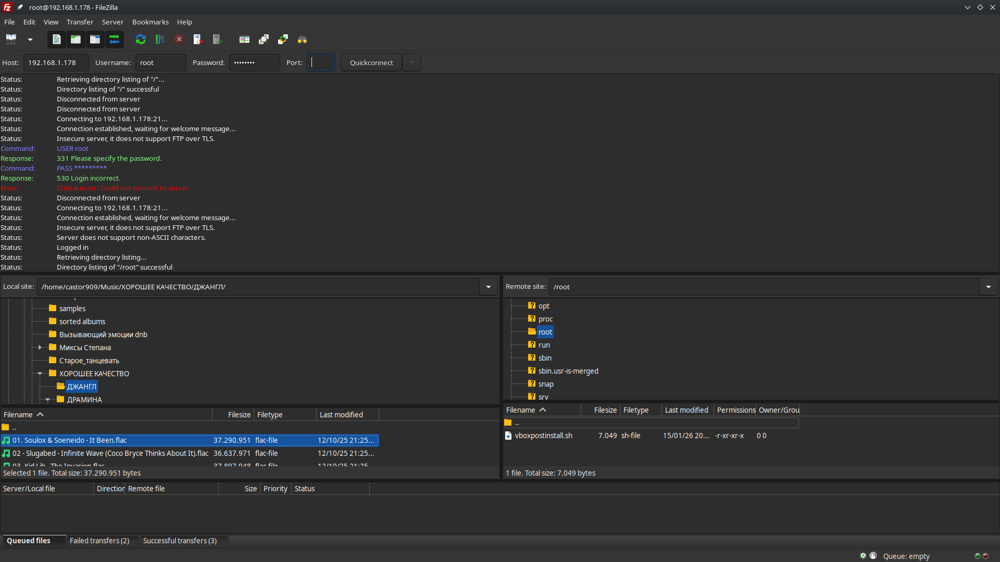

---

## 8. Captura de tráfico FTP (sin cifrar)

Con Wireshark capturando en la interfaz del host se conecta `daw_user` por FTP. Al
filtrar por `ftp` se identifican todos los elementos en **texto plano**:

**Lista de paquetes FTP (banner, USER/PASS, PWD/257, PASV/227):**  
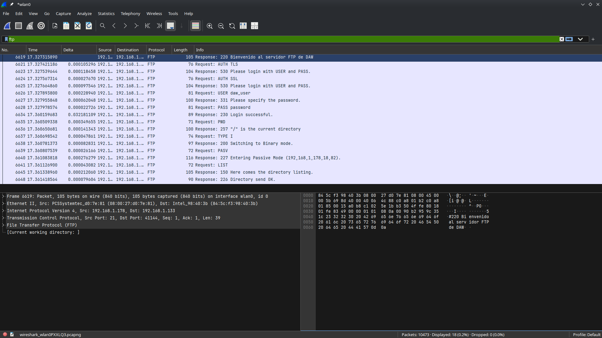

**Follow TCP Stream — diálogo completo en claro** (banner de bienvenida,
credenciales `PASS password`, directorio actual `257 "/"`, y
`227 Entering Passive Mode (192,168,1,178,18,82)`):  
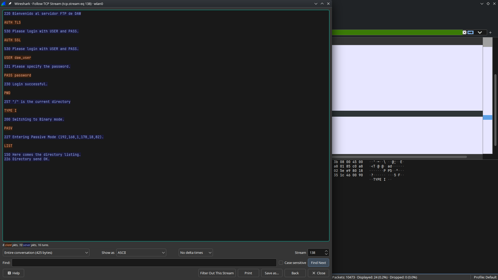

El puerto pasivo anunciado es `18×256 + 82 = 4690`, dentro del rango **4500-6000**:  
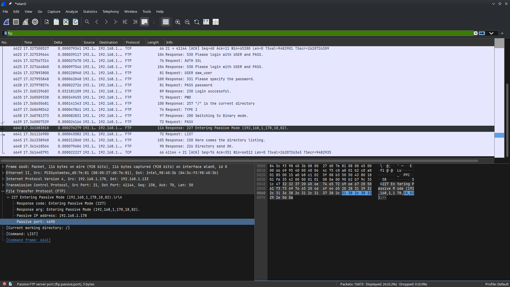

---

## 9. Certificado y activación de FTPS

Se genera el certificado autofirmado:

```bash
sudo openssl req -x509 -nodes -days 365 -newkey rsa:2048 \
  -keyout /etc/ssl/private/vsftpd.key -out /etc/ssl/certs/vsftpd.crt
```

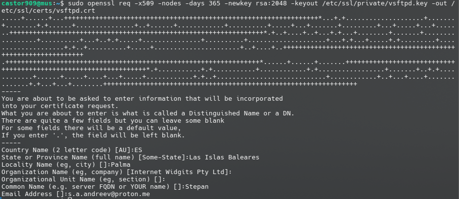

Se modifica `/etc/vsftpd.conf` para **deshabilitar los anónimos**
(`anonymous_enable=NO`) y habilitar **FTPS**:

```apache
rsa_cert_file=/etc/ssl/certs/vsftpd.crt
rsa_private_key_file=/etc/ssl/private/vsftpd.key
ssl_enable=YES
allow_anon_ssl=NO
force_local_data_ssl=YES
force_local_logins_ssl=YES
ssl_tlsv1=YES
ssl_sslv2=NO
ssl_sslv3=NO
require_ssl_reuse=NO
ssl_ciphers=HIGH
```

Tras reiniciar, el servidor **exige TLS**: el login en claro es rechazado (`530`).

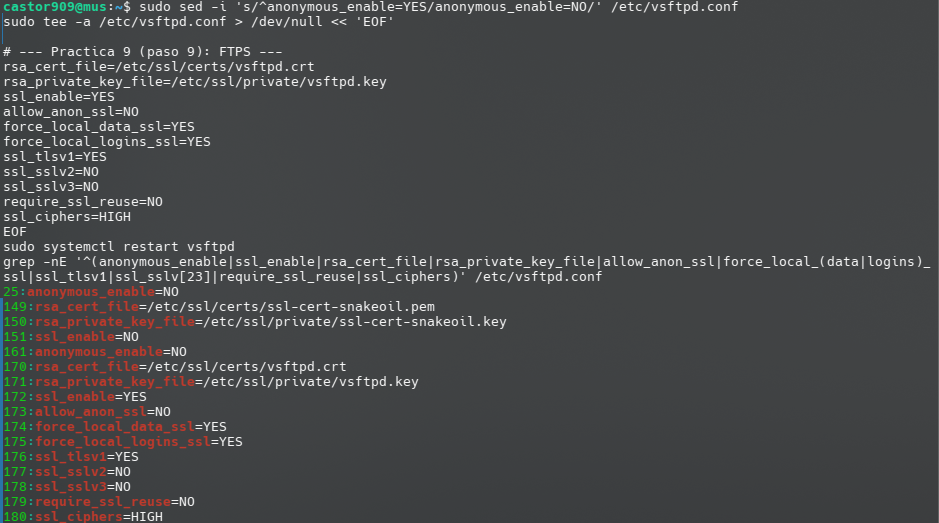

---

## 10. Captura de tráfico FTPS (cifrado)

Se vuelve a capturar en Wireshark y se conecta `daw_user` mediante **FTP explícito
sobre TLS**.

**FileZilla estableciendo la conexión TLS** (`TLS connection established`):  
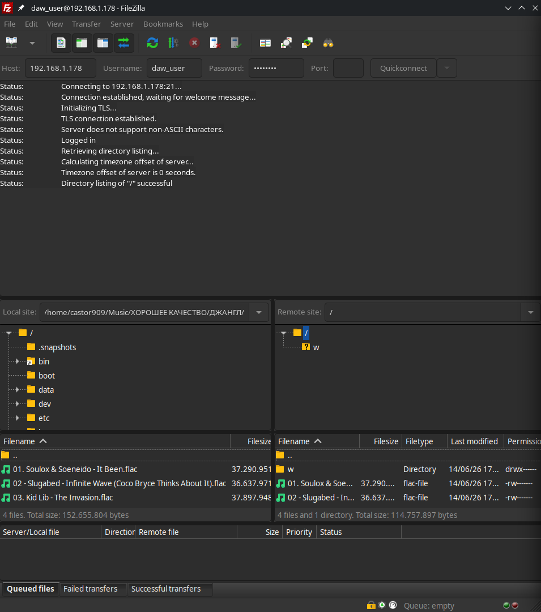

En Wireshark (filtro `ftp`) se ve el inicio de la negociación segura:
`Request: AUTH TLS` y `Response: 234 Proceed with negotiation`:  
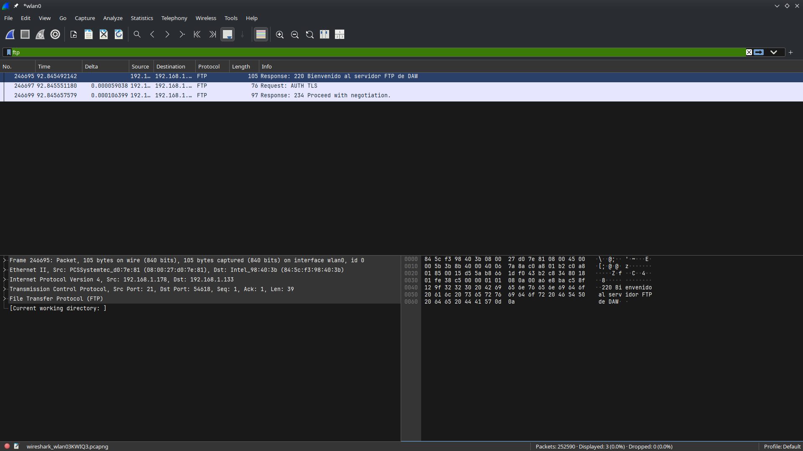

A partir de ahí, el tráfico (filtro `tls`) es **Encrypted Application Data**: las
credenciales viajan cifradas y no pueden leerse:  
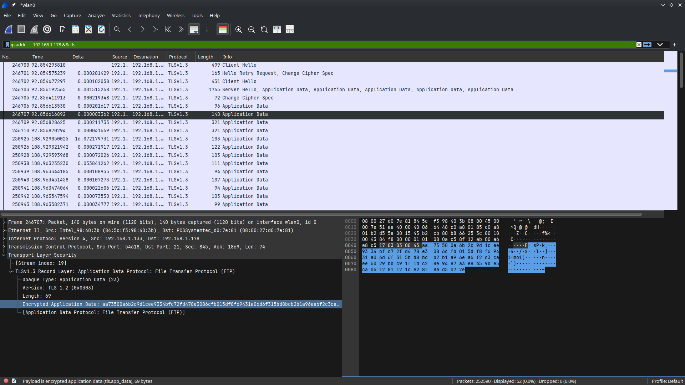

---

## Conclusión

Se ha desplegado un servidor FTP con vsftpd, con usuarios locales y anónimos,
control de escritura, enjaulamiento (`chroot`) con excepción para root, banner
personalizado y rango de puertos pasivos 4500-6000. La comparación entre el paso 8
(credenciales `PASS password` legibles sobre FTP) y el paso 10
(`Encrypted Application Data` sobre FTPS) demuestra la diferencia esencial: **FTPS
cifra el canal con TLS**, protegiendo las credenciales que en FTP plano viajan en
texto claro.
